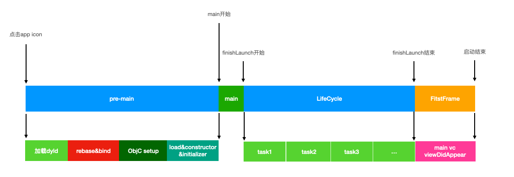
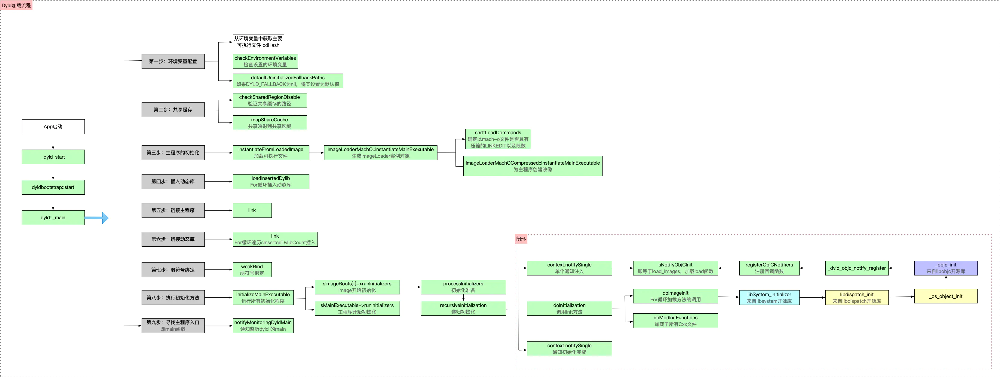
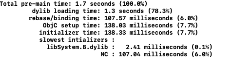
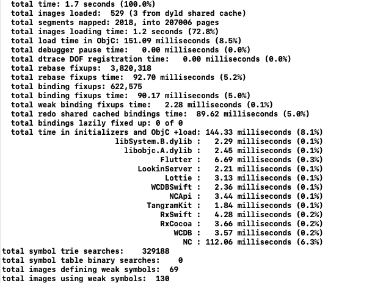
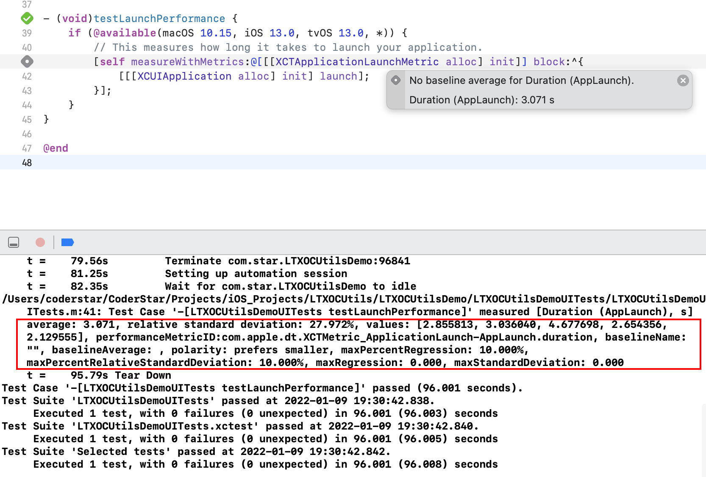
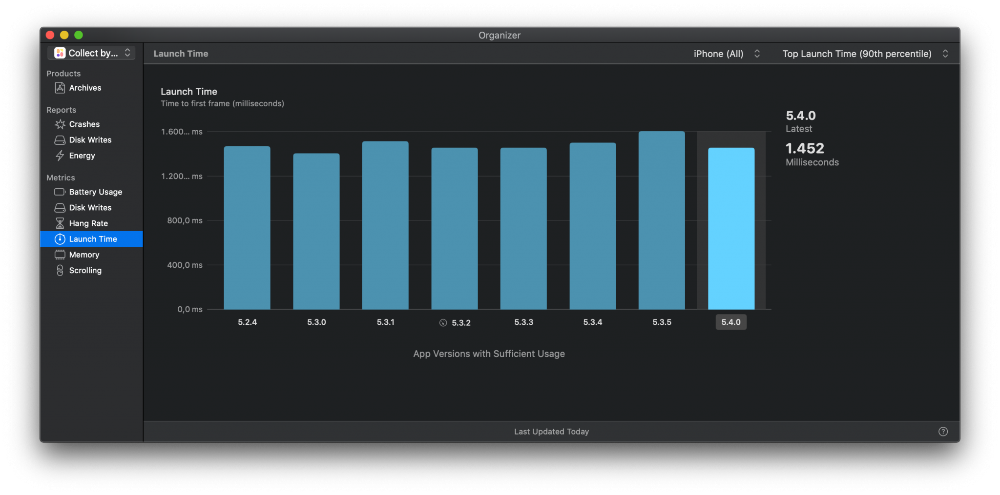

## 前言

Hi Coder，我是 CoderStar！

距离上次发完年终总结已经有将近一个月的时间，这一个月来也面试了将近 40 位候选人，或多或少有了一些感想，后面会单独发篇文章跟大家聊一聊这个话题。

之前曾在[iOS优化-瘦身](../../优化/iOS优化-瘦身)文章中提到过iOS优化将会是一个专题，今天就带来iOS优化系列的第二篇，主要介绍一下启动优化，即如何减少应用的启动时间。

其实关于这块，网上的资料已经很多了，本文主要梳理了一下我所知的优化方案并结合我实际使用给大家总结一下。WWDC对此专门有过一个session进行介绍 -- [Optimizing App Launch](https://developer.apple.com/videos/play/wwdc2019/423)，建议大家首先看看这个，毕竟Apple自家的工程师还是更权威一些的，下文中部分概念也会来自该视频资料。

## App 启动类型

App 启动过程有三种：冷启动、温启动 / 暖启动、 恢复

Cold |  Warm |  Resume
---------|----------|---------
After reboot | Recently terminated | App is suspended
App is not in memory | App is partially in memory | App is fully in memory
No process exists | No process exists | Process exists

下面简单介绍一下，这几种启动之间的区别：

冷启动：设备重启或者 App 很长时间未启动时会发生；这个过程需要建立进程并且启动支持 App 的系统端服务；
温启动：这个过程相对冷启动而言不会再重新建立系统端服务；
恢复：严格意义上，这不是启动，只是一个从后台到前台状态的改变。

> 为什么 App 很久未启动也会发生冷启动：在 iOS 上，处于后台的应用程序会逐渐从内存移除从而为前台应用程序提供更多的内存，所以当用户正在使用内存密集型的游戏应用，然后重新进入你的 App 程序，这时你的应用程序依赖于启动的框架和守护程序也可能需要重新启动并从磁盘调入。

我们在实际测量启动时间时应该是测量**温启动**类型，主要是冷启动状态不好统一，因为不好确定一些系统端服务的运行状态或者一些缓存的使用。

## App 启动过程

在优化之前，我们需要对 App 的完整启动过程有个了解，这样我们才能知道启动耗时分布的阶段、哪一个阶段可以被优化以及优化哪一个阶段 `ROI` 最高。

APP 的启动过程大部分情况都会被分成两部分，即`pre-main`以及`post-main`，其实还可以分的更细一点，分为三步：

- `pre-main`：main() 函数之前，即操作系统加载 App 可执行文件到内存，然后执行一系列的加载 & 链接等工作，最后执行至 App 的 `main()` 函数；
- `post-main`：`main()`函数之后，即从`main()`开始，到`appDelegate`的`didFinishLaunchingWithOptions`方法执行完毕；
- 首屏渲染：首屏构建完成可浏览 / 可操作页面；



### `pre-main`

在这个阶段，基本所有的工作都是由操作系统完成的，如果想要优化这段时间，就必须先了解一下，操作系统在`main()`函数之前做了什么。

`main()`函数之前操作系统所做的工作就是把可执行文件（Mach-O 格式）加载到内存空间，然后加载动态链接库 `dyld`，再执行一系列动态链接操作和初始化操作的过程（加载、绑定、及初始化方法）。

程序的加载是从`exec()`函数开始，`exec()` 是一个系统调用。操作系统首先为进程分配一段内存空间。然后将 App 的可执行文件加载到文件，并加载`dyld`，完成之后并将启动流程转给`dyld`去控制。

#### 加载流程

其实`pre-main`阶段的加载过程主要也是`dyld`的加载流程，所以下文就主要梳理一下`dyld`的加载流程。



`dyld`（the dynamic link editor）是苹果的动态链接器，是一个专门用来加载动态链接库的库，是开源的。在 `XNU` 内核为程序启动做好准备后，执行由内核态切换到用户态，由 `dyld` 完成后面的加载工作。

`dyld` 会首先读取 `mach-o` 文件的 `Header` 和 `load commands`，就知道了这个可执行文件依赖的动态库。例如加载动态库 A 到内存，接着检查 A 所依赖的动态库，就这样的递归加载，直到所有的动态库加载完毕。通常一个 App 所依赖的动态库在 100-400 个左右，其中大多数都是系统的动态库，它们会被缓存到 `dyld shared cache`，这样读取的效率会很高。

1. `dylib loading`
     * 设置运行环境。
       这一步主要是设置运行参数、环境变量等。也就是我们常通过 Xcode 设置的`Environment Variables`、`Arguments Passed On Launch`等。
     * 加载共享缓存。
       加载系统级别的动态库，比如`UIKit`等，位于`/System/Library/Caches/com.apple.dyld/dyld_shared_cache_armX`，X 为 ARM 处理器指令集架构。
     * 实例化主程序。
       这一步将主程序的 `Mach-O` 加载进内存，并实例化一个 `ImageLoader`，**内核**加载的主程序。
     * 加载插入的动态库。
       这一步是加载环境变量`DYLD_INSERT_LIBRARIES`中配置的动态库，`dyld` 负责。
2. `fixup`：`rebase`（偏移修正）/ `binding`（符号绑定）
     * 链接主程序。
       这一步调用 `link()` 函数将实例化后的主程序进行动态修正，让二进制变为可正常执行的状态。
     * 链接插入的动态库。
     * 执行弱符号绑定
3. Objc setup & initializer
     * 执行初始化方法。
        **dyld 会优先初始化动态库，然后初始化主程序。** 主要初始化内容包含两部分：
         - Objc setup
           - 初始化 Objective-C Runtime（包括 ObjC 相关 Class 的注册、`Category` 注册、`Selector` 唯一性检查等），
        - `initializer`
           - 调用 ObjC 的 `+load` 函数
           - 执行声明为 `__attribute__((constructor))` 的 C/C++ 函数
           - 创建 C++ 静态全局变量
4. 执行 main 函数
     * 查找入口点并返回，执行 `main` 函数

上述过程将我们常见的 App `pre-main`时期的启动过程与`dyld`的流程结合起来梳理一遍。其实我们也可以看到这个阶段主要是`dyld`的一个加载流程。所以 Apple 工程师也会对`dyld`的加载过程进行优化，`dyld3`相对于`dyld2`就有一些优化手段，比如启动闭包等，后续也会单独出一篇文章介绍一下`dyld`的迭代过程。

#### Rebase & Bind

可能有小伙伴对上面的 `Rebase` 以及 `Bind `过程有些疑问，这里就额外说下。

任何一个 App 生成的二进制文件内部所有的方法、函数调用，都有一个地址，这个地址是在当前二进制文件中的偏移地址。在 `ASLR`（Address Space Layout Randomization，地址空间布局随机化） 技术出现之前（dyld2 时出现的），程序都是在固定的地址加载的，这样 hacker 可以知道程序里面某个函数的具体地址，植入某些恶意代码，修改函数的地址等，带来了很多的危险性。

`ASLR` 技术就是每次 App 启动时，系统都会随机分配一个 ASLR 地址值（是一个安全机制，会分配一个随机的数值，插入在二进制文件的开头），例如，二进制文件中有一个 test 方法，偏移值是 0x0001，而随机分配的 ASLR 是 0x1f00，如果想访问 test 方法，其内存地址（即真实地址）变为 ASLR+ 偏移值 = 运行时确定的内存地址（即 0x1f00+0x0001 = 0x1f01）。

`Rebase` 就是在程序启动过程中根据 ASLR 随机地址值修改应用内存地址的过程。主要过程就是从 `__LINKEDIT`取出函数指针，根据偏移量修改函数指针，存入`__DATA` 中，Rebase 解决了**内部的符号引用**问题。

`Binding`：当引用动态库其他的函数或者变量时，当前 `mach-o` 文件会指向其他 `dylib`。这时候就需要 `Binding` 操作，`dyld` 会根据符号表去找到相应函数和变量地址，`Binding` 解决了**修正外部指针指向**的问题。例如程序中调用`NSLog`方法，在编译时期生成的 `mach-o` 文件中，会创建一个符号 `NSLog`（目前指向一个随机的地址），然后在运行时（从磁盘加载到内存中，是一个镜像文件），会将真正的地址给符号（即在内存中将地址与符号进行绑定，是 `dyld` 做的，也称为动态库符号绑定），一句话概括：绑定就是给符号赋值的过程。

#### 面试题扩展

- `load` 方法中是否可以调用 cateory 中的重名方法？
- `load` 方法在动态库，主工程的加载顺序？

### `post-main`

该阶段是指 `main` 函数执行之后到 `AppDelegate` 类中的 `applicationDidFinishLaunching:withOptions:` 方法执行结束前这段时间。

这个过程会涉及到一些启动项，如 SDK 的初始化，设置 `RootViewController` 等等。

### 首屏渲染

这个过程主要就是首屏页面的渲染过程。一般会用 `RootController` 的 `viewDidApper` 作为渲染的终点，但其实这时候首帧已经渲染完成一小段时间了，Apple 在 `MetricsKit` 里对启动终点定义是第一个 `CA::Transaction::commit()`。

## 指标及量化手段

应用启动时，会播放一个启动动画。iPhone 上是 `400ms`，iPad 上是 `500ms`，苹果建议启动时间最好不要超过启动动画的时间，并且启动时间超过 `20s` 将会被系统的看门狗机制直接杀死。

一般我们去量化启动时长会分为线下、线下两部分，线下我们可以利用 Apple 提供的工具，线上我们可以进行埋点或者通过 Apple 官方提供的性能监控工具获取相关数据。

一般`pre-main`阶段是操作系统自动完成，所以对该阶段的测量一般需要工具支持，而对于后面两个阶段，我们可以埋点的方式进行完成。

我们在对我们的优化措施进行验证时，一般都是先会使用线下的方式进行验证，但是线下的方式因为样本比较少等因素得到的结论不一定很准确，实际的指标还是需要看线上统计的数据，看一下 TP90 等指标。

### 线下

我们在测试过程这样有利于对测试环境的一致性。那如何保持测试环境的一致：

* 重启设备，并放置 2-3 分钟；
* 开启飞行模式或 Mock 网络数据，排除网络对启动阶段的影响；
* 关闭 `iCloud`；
* 尽可能使用 `Release Build` 进行测试；这样可以使用减少测量期间，不必要的调试代码的开销，并利用编译时优化；
* 选一个性能稍微差点的设备，这样就可以更大程度的满足更多的用户；

#### Environment Variables

`dyld`在加载流程代码中预埋了一下环境变量，所以我们可以通过添加环境变量的方式获取到`pre-main`的时间。

进入 `Product > Scheme > Edit Scheme... > Run > Arguments > Environment Variables`，增加`DYLD_PRINT_STATISTICS`，设置值为`1`，如果获取更详细的信息，可以使用 `DYLD_PRINT_STATISTICS_DETAILS`。

加入`DYLD_PRINT_STATISTICS`后，显示信息如下：



> 这个时间的显示顺序其实也跟我们上面介绍的 dyld 加载流程一致。

加入`DYLD_PRINT_STATISTICS_DETAILS`后



在使用这种方式时，需要注意两个地方：
- iOS 15 以上的真机不再支持打印相关耗时数据。
- 在 Debug 环境下拿到的数据会有`debugger pause time`的影响，我们可以将`scheme`中的`debug executable`进行关闭来去除该影响因素。

#### App Launch

Xcode 11 在 `Instruments` 中加入了 `App Launch` 模板用于我们 App 测量启动过程，并记录分析。

在 Xcode 中选择 `Profiling` 的方式进行编译。

这块就不详细介绍使用了，网上有很多教程。

#### XCTest

在 UITest 内 Xcode 自动帮我们生成好了用于测试 App 启动的测试用例：



此测试会启动你的应用 6 次，并且仅使用最后 5 个度量值。跳过了第一次启动，因为这被视为需要设置缓存的"冷启动"。

#### 日志

iOS 13.0 以后，在`隐私 - 分析与改进 - 分析数据`中有以 `log-power-xxx.session` 命名的日志文件，日志文件中提供了应用运行的一些基本数据信息。

> 该日志文件不是一个 App 对应一个文件，而是所有应用都是在一个文件中，我们可以根据我们应用的包名去找到对应的日志。

下面为我从我设备中`log-power-2022-01-09-113331.session`文件截出的一个应用的记录片段。

```json
 {
      "app_sessionreporter_key" : "69A6A581-C7E1-4ECD-BF82-3EAC569B13A7",
      "app_build_version" : "10.2.51.6000",
      "app_is_beta" : "false",
      "app_multiple_versions" : 0,
      "app_cohort" : "7|date=1603521000000&sf=143465&pgtp=Search&pgid=c6323522-55b2-4d88-b4ae-b3b338b1fd0d&prpg=Genre_179183&ctxt=Search&issrch=1",
      "app_version" : "10.2.51",
      "app_adamid" : 333206289,
      "app_arch" : "",
      "app_bundleid" : "com.alipay.iphoneclient", // App包名
      "slice_uuid" : "",
      "app_storefront" : 143465,
      ...
      ...
      "performance_metrics" : {
        "disk_io" : {
          "totalWrites" : 160706560,
          "totalReads" : 2143322112
        },
        "memory" : {
          "average" : 164666852,
          "peak" : 223054080
        },
        "app_performance" : {
          "launch" : { // App启动时长相关
            "fg" : {
              "count" : 0,
              "sessions" : [

              ]
            },
            "bg" : {
              "count" : 2, // 启动次数
              "sessions" : [ // 每次启动，启动时长
                1000,
                1200
              ]
            }
          },
          "processExits" : {
            "bg" : {
              "cumulativeMemoryPressureExitCount" : 3
            }
          }
        }
      },
      "app_is_clip" : 0
    }
```

从上面注释我们可以很明显看到 App 包名、启动次数、启动时长相关数据。

### 线上

#### Xcode Organizer

通过 Xcode 自带工具来查看，选择 `Xcode —> Window —> Organizer`，在左侧菜单栏选择 `Launch Time` 项查看线上用户 APP 的启动耗时数据，这种方式主要看线上用户整体启动耗时区间分布情况；



#### MetricKit

`MetricKit` 是苹果 iOS 13 推出的框架，其会在一天结束后，将过去 24 小时内收集的性能数据归集在一起，并在下一次 App 启动时，通过 delegate 方法回调给我们。

其在官方层面实现了 App 性能监控的大一统，包含 App 的启动、电量、内存等多方面的监控。

其中`MXAppLaunchMetric`可以用来监控 App 启动相关情况。

具体细节可看 [WWDC 2020 - 10081 What's new in MetricKit](https://developer.apple.com/videos/play/wwdc2020/10081/)，或者老司机周报翻译的 [WWDC20 10081 - MetricKit 中的新功能](https://xiaozhuanlan.com/topic/3572084169)。

#### 埋点

##### 进程启动时间

**方式一**

这种方式据小伙伴和一些文章说会有一定的偏差。

```objective-c
#import <sys/sysctl.h>
#import <mach/mach.h>

+ (BOOL)processInfoForPID:(int)pid procInfo:(struct kinfo_proc*)procInfo
{
    int cmd[4] = {CTL_KERN, KERN_PROC, KERN_PROC_PID, pid};
    size_t size = sizeof(*procInfo);
    return sysctl(cmd, sizeof(cmd)/sizeof(*cmd), procInfo, &size, NULL, 0) == 0;
}

+ (NSTimeInterval)processStartTime
{
    struct kinfo_proc kProcInfo;
    if ([self processInfoForPID:[[NSProcessInfo processInfo] processIdentifier] procInfo:&kProcInfo]) {
        return kProcInfo.kp_proc.p_un.__p_starttime.tv_sec * 1000.0 + kProcInfo.kp_proc.p_un.__p_starttime.tv_usec / 1000.0;
    } else {
        NSAssert(NO, @"无法取得进程的信息");
        return 0;
    }
}
```

```swift
extension ProcessInfo {
    public var uptime: TimeInterval {
        return Date().timeIntervalSince(startTime)
    }

    public var startTime: Date {
        return processStartTime(for: processIdentifier)
    }

    public func processStartTime(for pid: Int32) -> Date {
        var mib = [CTL_KERN, KERN_PROC, KERN_PROC_PID, pid]
        var proc = kinfo_proc()
        var size = MemoryLayout.size(ofValue: proc)
        mib.withUnsafeMutableBufferPointer { p in
            _ = sysctl(p.baseAddress, 4, &proc, &size, nil, 0)
        }

        let time = proc.kp_proc.p_starttime
        let seconds = Double(time.tv_sec) + Double(time.tv_usec) / Double(NSEC_PER_SEC)

        return Date(timeIntervalSince1970: seconds)
    }
}
```

**方式二**

创建一个自定义动态库（或直接使用已有的自定义动态库），在 `+load` 方法中进行埋点作为 APP 的启动时间，为了尽可能将其他动态库中的耗时统计到，我们可以将自定义的动态库放在所有动态库加载的第一位。

那如何让动态库处于加载顺序的第一位？

如果是 CocoaPods 管理的项目，调整 `Pods-XXXX.debug.xcconfig` 文件中的`OTHER_LDFLAGS`配置顺序即可；（默认应该是按照首字母排列的）

如果是原生项目，直接调整`Build Phases`的`Link Binary With Library`的顺序即可。

##### `pre-main` 结束时间

推荐使用`__attribute__((constructor))`构建器函数的被调用时间点作为 `pre-main` 阶段结束时间点：能最大程度实现解耦。

> 之所以不使用`+load`方法主要原因是不确定最后执行的`+load`方法是哪一个，即使当时确认了，后续随着业务迭代也会变化。

```objective-c
void static __attribute__((constructor)) before_main() {
    // 获取时间
}
```

##### `main`结束时间

`applicationDidFinishLaunching:withOptions:`函数的结束时进行打点。

##### 首屏渲染完成时间

在 `RootController` 的 `viewDidApper` 中进行打点，或者按照`MetricsKit`里对启动终点的定义，在第一个 `CA::Transaction::commit()` 中打点。

##### 扩展

在 iOS 15 及更高版本中，系统可能会根据设备条件预热您的应用程序 — 启动未运行的应用程序进程以减少用户在应用程序可用之前等待的时间。

而这个预热机制也会对我们的启动埋点造成影响，即进程启动到`main`函数这段时间间隔可能会超过正常情况。

```swift
if let activePrewarm = ProcessInfo.processInfo.environment["ActivePrewarm"] {
  /// 当 activePrewarm 为1时，就表示为预热
}
```

[about_the_app_launch_sequence](https://developer.apple.com/documentation/uikit/app_and_environment/responding_to_the_launch_of_your_app/about_the_app_launch_sequence?language=objc#3894431)

## 优化措施

下面是一些常用的优化手段，优化起来易，防劣化起来难。

### pre-main 阶段优化

#### 库的优化

- 动态库转静态库；
- 减少动态库的个数，可以采用合并手段，将多个动态库合并成一个，官方建议动态库数量小于 6 个；
- 动态库懒加载；

> 这里的动态库不是指系统动态库，而是我们自己新建的动态库，也就是所谓的`Embedded Framework`，它无法像系统库一样被其他应用所公有，只能让`App Extension`和`APP`之间共用一份。

正常情况下，我们的项目中一般都是静态库，当然一些情况下我们也是有使用动态库的需求。

- 我们利用动态库先执行初始化方法的特性去执行一些需要最先执行的方法。
- CocoaPods 早期版本管理 Swift 项目时，只能以动态库的形式去引入三方、二方库；
- 项目中有`App Extension`，可以利用动态库一定范围内共享的特性去减少包体积
- ...

当然我们还可以利用动态库运行时链接的特性，去将一些动态库进行懒加载。所谓懒加载就是动态库只打包进 App，但是在启动时不参与链接，即可以在 `podspec` 里添加 `spec.weak_frameworks` = 'XXX'，并保证 `Link Binary With Libraries` 和 `Other Linker Flags` 没有链接对应的动态库，然后在 App 运行中用到动态库内的实现时，在调用之前先通过`[NSBundle loadAndReturnError:]`或者`dlopen()`去加载动态库，然后再调用到实际的业务代码。

这种优化方式适合依赖少、比较稳定的库。目前了解到做了动态库懒加载的包括 58、贝壳等。

动态库懒加载相对于静态库少了`fixup`以及初始化等耗时。

结合我的实际项目，项目为一个`Swift-OC`混编项目，主体为 Swift，CocoaPods 管理库的方式为动态库，本地调整为静态库，具体方式为：

- 去掉`use_frameworks!`；
- 添加`use_modular_headers!`，原因是部分 Swift 二方库内部使用了 OC 代码，对于不支持`modular`的库进行调整，其中主要包含`WCBD`；
- 检查库内部资源使用方式，是否存在硬编码资源路径的问题，经检查，确实发现有存在的问题，继而修复；

更换完毕之后，根据线下的测试数据，`pre-main`阶段的启动耗时相比之前有将近`100%`的提升。

更换完毕之后也带来了一些包体积方面的正向收益，过去各 Pod `Strip Style`均为`Debugging Symbols`，换为静态库后，就使用的是 Project 下的`All Symbols`，从`Apple Connect`后台看在迭代升级一版的前提下，包的下载大小反而降低了**5.1M**。

#### 初始化控制

- 清理项目中未用到的类、类别、方法等，这个过程会影响很多方面，代码减少会降低 `fixup` 的次数，也会降低`Objc setup`的时间，也会减少包体积；开发者自己也要养成无用代码及时删除的好习惯。
- 将 `load` 方法里面执行的逻辑延迟执行，如放入到首屏渲染后或者 `+initialize` 执行；关于这块需要跟具体的业务相结合去调整；
- 控制 C++ 全局变量的数量；
- 尽量不使用 C++ 虚函数；

#### 其他

- 二进制重排；
- 换`Swift`吧，利用其拥有的函数直接派发方式；

二进制重排这个估计大家都很清楚了，简单说下吧。核心原理就是利用二进制重排减少启动时`Page Fault`（缺页中断）发生的次数。

主要分成两步：

- 利用 `clang` 插桩获得启动时期需要加载的所有函数、block、swift 方法以及 c++ 构造方法的符号；
- Xcode 的`Build Settings`配置`order file`即可；

其中第一个步骤是关键步骤，其实核心就是利用 LLVM 内置的`SanitizerCoverage`工具进行符号收集。

- 在 `Build Settings` 中添加编译选项 `Other C Flags` 增加`-fsanitize-coverage=func,trace-pc-guard`;
- 如果是 OC Swift 混编， 则在 Other Swift Flags 增加
   - `-sanitize-coverage=func`
   - `-sanitize=undefined`

> 如果是 CocoaPods 管理的项目，就需要为每一个 Pod 增加这些编译选项。

至于代码示例直接看杨帝的[AppOrderFiles](https://github.com/yulingtianxia/AppOrderFiles)

> 扩展下，编译器在生成二进制代码的时候，默认会先编译 OC 的代码，然后在编译 Swift 的代码，在此顺序前提下，会按照编译文件顺序、方法在文件中的顺序生成。

### `post-main` 阶段优化

这个阶段跟我们的业务结合的比较紧密，我们一般情况下会需要在`applicationDidFinishLaunching:withOptions:`中做很多初始化的工作，比如网络、统一样式，三方 SDK 初始化等，我们需要根据我们业务的特性去优化该阶段。

- 梳理相关业务逻辑，将可以延迟加载的库或者逻辑进行延时加载；
- 考虑使用多线程充分利用 CPU 性能；

这里建议大家可以去看下之前写的[AppDelegate解耦](../../../../设计模式/设计模式%20-%20命令模式&中介者模式&组合模式~AppDelegate%20解耦)对AppDelegate进行拆解，这样利于对启动过程相关业务的解耦以及后续的调整。

### 首屏渲染优化

这个阶段其实对 UI 渲染效率的提升了，优化手段也就是渲染优化方面的通用手段了。

- 尽量使用纯代码编写，减少 `xib/storyboard` 的使用，首页布局不要过于复杂，必要时 `AutoLayout` 变为 `Frame` 布局；
- 在 `viewDidLoad` 以及 `viewWillAppear` 方法中少做逻辑，或者采用异步的方式去做；
- 减少视图层级；
- 懒加载 View；

## 最后

在`pre-main`期间各 App 使用的优化措施可能更一致些，而后面两个页面就需要根据我们的业务特性去进行对应的调整了，遵循的原则也很简单，就是**尽量少做，最好不做**。同时在专项优化启动时间后，也要制定相应的措施去防止劣化。

Let's be CoderStar!

**参考资料**

- [reducing-your-app-s-launch-time](https://developer.apple.com/documentation/xcode/reducing-your-app-s-launch-time)
- [58 同城 App 性能治理实践-iOS 启动时间优化](https://mp.weixin.qq.com/s/wkK2UBvuUZW3Pf0Yd_3XTA)
- [iOS 优化篇 - 启动优化之Clang插桩实现二进制重排](https://juejin.cn/post/6844904130406793224)
- [脉脉iOS如何启动秒开](https://zhuanlan.zhihu.com/p/396550853)
- [iOS 应用的启动流程和优化详解](https://juejin.cn/post/6951591401528229895)
- [抖音品质建设 - iOS启动优化《原理篇》](https://mp.weixin.qq.com/s/3-Sbqe9gxdV6eI1f435BDg)
- [Optimizing App Launch](https://developer.apple.com/videos/play/wwdc2019/423/)
- [美团外卖iOS App冷启动治理](https://tech.meituan.com/2018/12/06/waimai-ios-optimizing-startup.html)
- [dyld详解](https://www.dllhook.com/post/238.html)
- [launch-time-performance-optimization](https://www.avanderlee.com/optimization/launch-time-performance-optimization/)
