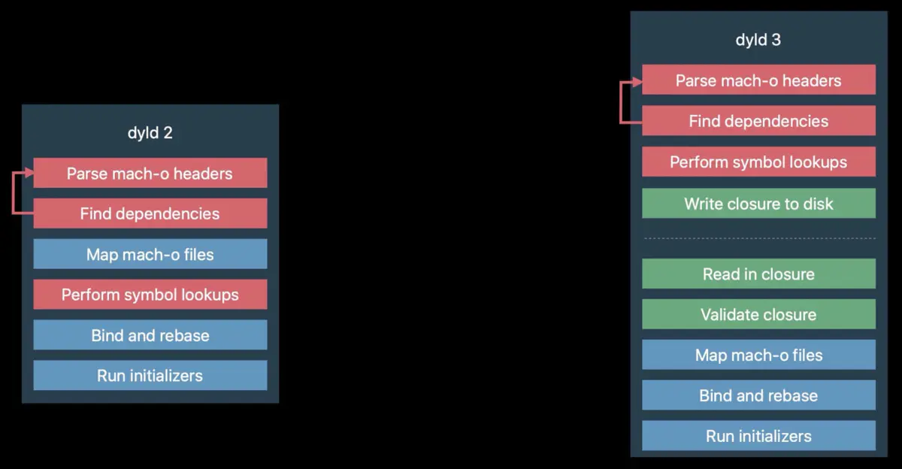

## 前言

Hi Coder，我是 CoderStar！

## `dyld` 迭代

我们对`dyld`展开讲一下，其是开源的，我们可以[官网下载](https://opensource.apple.com/tarballs/dyld/)后阅读其源码。

### dyld 1.0（1996-2004）

一般大家很少提到这个版本的`dyld`，因为这个版本有很多东西都不完善，用起来也会有很多风险。

`dyld 1`包含在 `NEXTStep 3.3` 中，在此之前的 `NEXTStep` 使用静态二进制数据，作用并不是很大。

`dyld 1` 是在系统广泛使用 C++ 动态库**之前**编写的，由于 C++ 有许多特性，例如其初始化器的工作，在静态环境工作良好，但是在动态环境中可能会降低性能，因此大型的 C++ 动态库会导致 `dyld` 需要完成大量的工作，速度变慢。

在发布 `macOS 10.0` 和 `Cheetah` 前，还增加了一个特性，即 `Prebinding` 预绑定。我们可以使用 `Prebinding` 技术为系统中的所有 `dylib` 和应用程序找到固定的地址。`dyld` 将会加载这些地址的所有内容。如果加载成功，将会编辑所有 `dylib` 和程序的二进制数据，来获得所有预计算。当下次需要将所有数据放入相同地址时就不需要进行额外操作了，将大大的提高速度。但是这也意味着每次启动都需要编辑这些二进制数据，至少从安全性来说，这种方式并不友好。

### dyld 2（2004-2017）

`dyld 2` 从 2004 年发布至今，已经经过了多个版本迭代，我们现在常见的一些特性，例如 `ASLR`、`Code Sign`、`share cache` 等技术，都是在 `dyld 2` 中引入的。

`dyld 2` 是 `dyld 1` 完全重写的版本，可以正确支持 C++ 初始化器语义，同时扩展了 `mach-o` 格式并更新 dyld，从而获得了高效率 C++ 库的支持。

`dyld 2` 具有完成的 `dlopen` 和 `dlsym`（主要用于动态加载库和调用函数）实现，且具有正确的语义，因此弃用了旧版的 API。

通过多种方式增加安全性
  * 增加 codeSigning 代码签名、
  * ASLR（Address space layout randomization）地址空间配置随机加载：每次加载库时，可能位于不同的地址
  * `bound checking` 边界检查：mach-o 文件中增加了 Header 的边界检查功能，从而避免恶意二进制数据的注入

增强了性能
  * 可以消除 `Prebinding`，用 `share cache` 共享代码代替。

`share cache`是一个单文件，包含大多数系统`dylib`，由于这些`dylib`合并成了一个文件，所以可以进行优化，继而提高启动速度。

* 重新调整所有文本段（`_TEXT`）和数据段（`_DATA`），并重写整个符号表，以此来减小文件的大小，从而在每个进程中仅挂载少量的区域。允许我们打包二进制数据段，从而节省大量的 RAM；
* 本质是一个 `dylib` 预链接器，它在 RAM 上的节约是显著的，在普通的 iOS 程序中运行可以节约 `500-1g` 内存；
* 还可以预生成数据结构，用来供 dyld 和 ObjC 在运行时使用。从而不必在程序启动时做这些事情，这也会节约更多的 RAM 和时间；

>  `share cache`位于`/System/Library/Caches/com.apple.dyld/dyld_shared_cache_armX`，X 为 ARM 处理器指令集架构，需要注意的是在 iOS 系统上这个文件并不是在设备开机时每次进行合成，一般越狱后进行对此进行删除，可能设备就无法正常使用了。如果是 MacOS 系统，应该是每次设备启动动态生成。
>
>  一般我们想要拿到系统库的符号表，也是从这个`share cache`上入手，这里说一个工具[dyld_cache_extract](https://github.com/macmade/dyld_cache_extract)

### dyld 3（2017-2021）

dyld 3 是 2017 年 WWDC 推出的全新的动态链接器，它完全改变了动态链接的概念，且将成为大多数 macOS 系统程序的默认设置。2017 Apple OS 平台上的所有系统程序都会默认使用 dyld 3。

dyld 3 最早是在 2017 年的 iOS 11 中引入，主要用来优化系统库，而在 iOS 13 系统中，iOS 全面采用新的 dyld 3 来替代之前的 dyld 2，因为 dyld 3 完全兼容 dyld 2，其 API 接口也是一样的，所以，在大部分情况下，开发者并不需要做额外的适配就能平滑过渡。

以下是 dyld 2 向 dyld 3 的一些改变，主要是将安全敏感的部分 和 占用大量资源的部分移动到上层，然后将一个 `closure` 写入磁盘进行缓存，然后我们在程序进程中使用 `closure`。

dyld2 和 dyld3 的加载方式略有不同。dyld2 是纯粹的 in-process，也就是在程序进程内执行的，也就意味着只有当应用程序被启动的时候，dyld2 才能开始执行任务。dyld3 则是部分 `out-of-process`，部分 `in-process`。上图中右侧 dyld3 虚线上便是`out-of-process`。

dyld2 的过程是：加载 dyld 到 App 进程，加载动态库（包括所依赖的所有动态库），Rebase，Bind，初始化 Objective C Runtime 和其它的初始化代码。

dyld3 的 `out-of-process` 会做如下事情：

* 分析 Mach-o Headers
* 分析依赖的动态库
* 查找需要 Rebase & Bind 之类的符号
* 注册objc的class、method等元数据。
* 把上述结果写入缓存

等我们启动应用时，会对闭包进行校验，直接能享受到闭包的缓存。

dyld 3 包含三个组件：

* 本进程外的 Mach-O 分析器 / 编译器（一个后台程序）；
在 dyld 2 的加载流程中，`Parse mach-o headers` 和 `Find Dependencies` 存在安全风险（可以通过修改 mach-o header 及添加非法 @rpath 进行攻击），而 Perform symbol lookups 会耗费较多的 CPU 时间，因为一个库文件不变时，符号将始终位于库中相同的偏移位置，这两部分在 dyld 3 中将采用提前写入把结果数据缓存成文件的方式构成一个`lauch closure`（可以理解为缓存文件）。

* 本进程内执行`lauch closure`的引擎；
验证`lauch closures`是否正确，映射 dylib，执行 main 函数。此时，它不再需要分析 mach-o header 和执行符号查找，节省了不少时间。

* `lauch closure`的缓存：
**系统程序的`lauch closure`直接内置在 `shared cache` 中，而对于第三方 APP，将在 APP 安装或更新时生成**，这样就能保证`lauch closure`总是在 APP 打开之前准备好。内部存储包括：

* dependends：依赖动态库列表
* fixup：bind & rebase 的地址
* initializer-order：初始化调用顺序
* optimizeObjc: Objective C 的元数据
* 其他：main entry, uuid…

启动闭包里面的fixup并不能替代App启动过程中的fixup过程，启动缓存里面的fixup信息是fixup流程中的一部分；
启动闭包里面的fixup：
- bind：提前获取符号的地址，等到启动的时候将符号的地址绑定到符号上去；
- rebase：启动闭包里面的缓存主要是对`opcode`的解析。
  > opcode 存储空间小，使用变长的编码方式，字符串这些也是 trie 树存储的。

> 启动闭包存储在`tmp/com.apple.dyld`目录下，当把该目录删除后，在 App 启动时会重新创建启动闭包；

闭包名称为 `XCExecutableName`-64位16进制.closure

总体来说，dyld 3 把很多耗时的操作都提前处理好了，极大提升了启动速度。

**dyld 3 的符号缺失问题**

dyld 2 默认采取的是 lazy symbol 的符号加载方式，但在 dyld 3 中，在 app 启动之前，符号解析的结果已经在'lauch closure'内了，所以'lazy symbol'就不再需要。这时，如果有符号缺失的情况，APP 的行为会有不同：在 dyld 2 中，首次调用缺失符号时 APP 会 crash；而 dyld 3 中，缺失符号会导致 APP 一启动就会 crash。

### dyld4（2021-）

[dyld4](https://github.com/apple-oss-distributions/dyld/blob/main/doc/dyld4.md)

iOS 16。

dyld3 出于对启动速度的优化，增加了启动闭包。应用首启和发生变化时将一些启动数据创建为闭包存到本地，下次启动将不再重新解析数据，而是直接读取闭包内容。这种方法的理想情况是应用程序和系统应很少发生变化，因为如果这两者经常变化，即意味着闭包可能面临失效。为了应对这类场景，dyld4 采用了 Prebuilt + JustInTime 的双解析模式，Prebuild 对应的就是 dyld3 中的启动闭包场景，JustInTime 大致对应 dyld2 中的实时解析，JustInTime 过程是可以利用 Prebuild 的缓存的，所以性能也还可控。应用首启、包体或系统版本更新、普通启动，dyld4 将根据缓存有效与否选择合适的模式进行解析。
dyld3 在不使用启动闭包的情况下会 fallback 到 dyld2，两套代码分别在两边，不利于行为的统一和维护，dyld4 做了逻辑统一（@鹅喵 补充）。所以 dyld4 的设计目标是更优的兼容性和逻辑统一。

dyld4存储目录，发生了改变，会存放在 `Library/Caches/com.apple.dyld` 目录下，后缀为 dyld4 。

闭包名称为 `XCExecutableName`.dyld4

## 最后

要更加努力呀！

Let's be CoderStar!

- [iOS-底层原理 15：dyld发展史](https://www.jianshu.com/p/ee6a8ebc5bec)
- [iOS 13中dyld 3的改进和优化](https://easeapi.com/blog/blog/83-ios13-dyld3.html)
