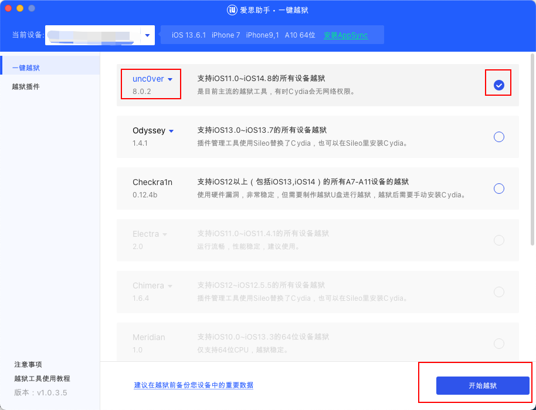
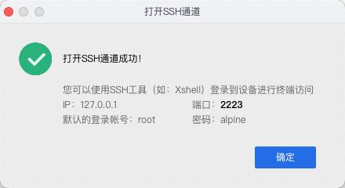
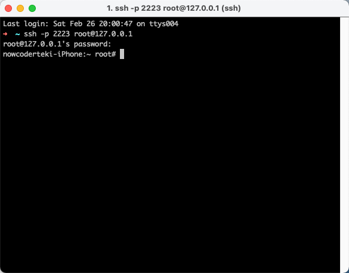
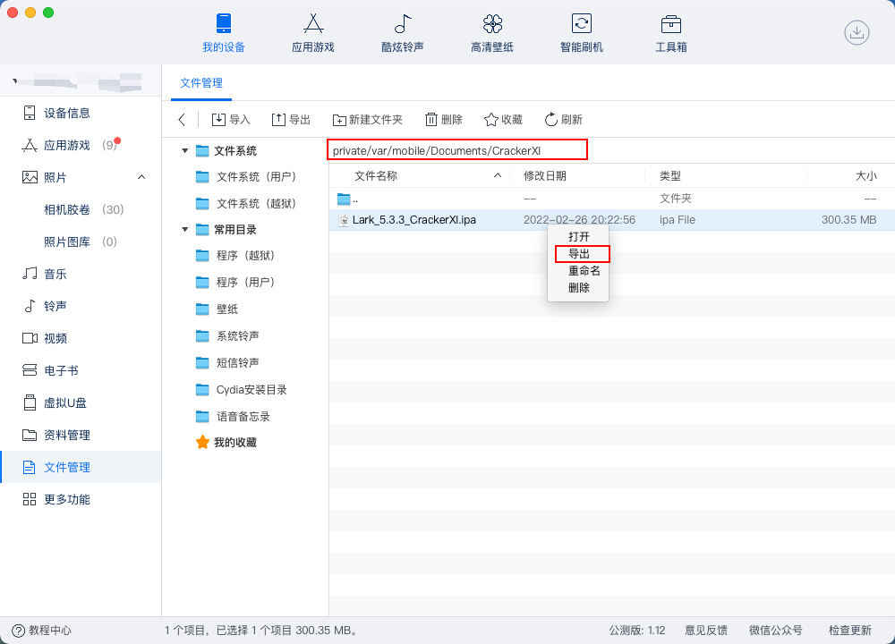

## 前言

Hi Coder，我是 CoderStar！

## 工具概念

关于越狱先解释一些概念，可能更方便大家对后续出现的名词的理解。

### 越狱工具

我们将 iOS 设备越狱，目的就是能更大尺度去控制我们的 iOS 设备来让其有更高的可玩性。那常用的越狱工具包括：

- unc0ver
- Checkra1n

### 包管理器

越完狱之后只是意味着我们对 iOS 设备的掌控权更大了，那怎么让其更可玩呢？越狱商店就应运而生了，我们可以通过其下载到各种各种的插件，来让我们的设备各有意思，那最出名的商店便是`Cydia`了，当然使用`unc0ver`等越狱工具将设备越狱后就会自动安装越狱商店。

- Cydia
- Sileo
- Zebra
- Saily

其实还会有一些不需要越狱的商店，比如：

- AltStore

## 越狱

机型：iPhpne 7
系统：13.4.1 / 13.6.1
步骤：

下载爱思助手，打开工具箱，点击一键越狱，选择方式为`uncOver`，版本选择`8.0.2`；

> 如果`8.0.2`不行，就慢慢向下选择低版本；

> 在越狱之前，一定要选低版本的 iOS 系统，最好是 14 以下，我在选择 iOS 14.3 时出现了一些问题
> - 使用 iOS 14.3 的系统，使用爱思助手，使用任何的`uncOver`版本以及`Checkra1n`版到了安装软件阶段都会提示安装失败，放弃；
>- 使用 iOS 14.3 的系统，不借助爱思助手，使用`AltStore`方式安装下载下来的`uncOver.ipa`文件，安装成功，但是等在手机上使用 uncOver 开始进行越狱时，到达某个阶段，就会弹出一个提示框，选择跳过后，提示出现了问题，放弃；
>- 使用 iOS 14.3 的系统，不借助爱思助手，使用`Checkra1n`来进行越狱，但是根据提示一直迟迟进入不了`DFU`模式，放弃；

爱思助手提示成功后，设备上会出现一个`uncOver` App。

点击里面的开始越狱按钮，就可以开始越狱了，中间会出现弹框，跳过即可，还会出现多次重启的现象，重启之后还是继续打开`uncOver` App 点击按钮，一直等到出现越狱完成的提示，这时桌面上回多出`Cydia`应用以及`Substitute`应用。

> 到这里，越狱阶段基本完成，其中需要注意我当前这个越狱为不完美越狱，每次设备重启之后还得再使用`uncOver`来激活一下；

[unc0ver.dev](https://unc0ver.dev/)
[uncover](https://tweak-box.com/uncover/)
[checkra](https://checkra.in/)

## Cydia

### 常用源

- BigBoss：http://apt.thebigboss.org/repofiles/cydia/

### 常用插件

`Cydia`中我们可以通过订阅一些源来下载各种各样的插件，带来各种各样的功能；在搜索插件之前，需要给`Cydia`一点时间去同步一些源信息。

> 不同的插件所在源可能不同，所以有的时候在添加指定插件前需要添加一个指定的源；

#### Lookin

在`Cydia`中添加 `Lookin` 插件需要单独加入一个源`BigBoss`才能搜索到，安装成功之后，我们在设置下面找到`Lookin`应用，点击进入之后，勾选允许的应用。

`Mac`上下载对应的`Lookin`软件，这时我们就可以查看我们刚才允许的应用中任意一个应用的视图结构了，**当然要保证你检查视图的应用在前台**。

#### OpenSSH

通过`OpenSSH`插件，我们可以通过`SSH`协议在我们的电脑上访问到移动设备上的相关数据。

首先在`Cydia`里搜索下载`OpenSSH`插件，并且通过爱思助手打开 SSH 通道。

然后根据上图相关信息使用命令登录到设备上。

这个时候我们就可以像访问服务器一样去访问我们的移动设备了，对相关目录结构可以了如指掌了。

#### Filza

文件管理软件，可以安装 `deb` 文件。

## 取出设备文件

### 爱思助手

### SCP 命令

`scp -P 2223 -r root@127.0.0.1:/private/var/mobile/Documents/CrackerXI/Lark_5.3.3_CrackerXI.ipa /Users/coderstar/Desktop`

## 脱壳

### CrackerXI

* 添加`http://apt.cydiami.com`，然后搜索`CrackerXI`安装；

* 打开`CrackerXI`，然后在`settings`中设置`CrackerXI Hook`为`enable`;

* 设置完`CrackerXI`，查看`AppList`是否有需要被砸壳的目的 App，如果有的话，选择它进行砸壳;

* 砸壳步骤根据`CrackerXI`提示，一直选择 yes 即可。

* `CrackerXI`砸壳后，通过`ssh`连接手机后，即可在`/var/mobile/Documents/CrackerXI/` 中看到砸壳后的 App；

### Clutch

### dumpdecrypted

### frida-ios-dump

## MonkeyDev

## 最后

要更加努力呀！

Let's be CoderStar!
