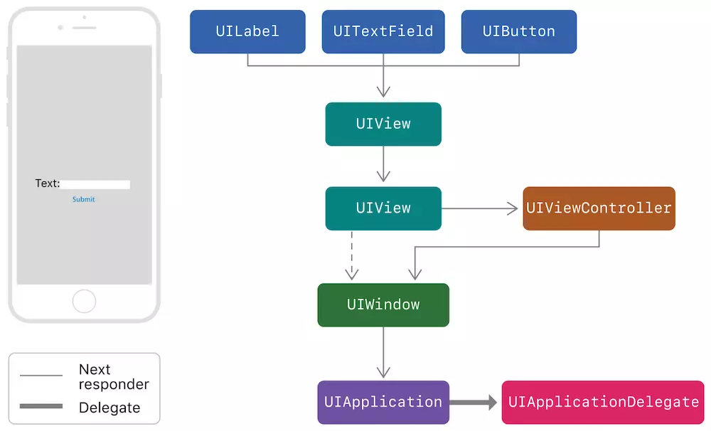

## 1、Class与Struct之间的区别

* **Class是引用类型，Struct是值类型;**

这里引申一下，引用类型与值类型区别其实可以与深拷贝与浅拷贝****对应起来，值类型在赋给另一个变量时会对值进行一次拷贝，而引用类型赋给另一个变量是将引用地址赋给它。值类型如果每次赋值时候都进行拷贝的话会增大内存开销，实际上只有值类型发生改变的时候才会进行真正的拷贝--“写时复制（Copy-On-Write）”的特性，当没有改变时，两者共享同一个内存地址。

* **Struct不能继承，Class可以继承**
* **Class需要自己定义构造器，而Struct不需要；**(Struct默认生成的构造器必须包括所有成员参数，只有当所有参数都为可选型时，可直接不用传入参数直接简单构造) 举一反三：Class中的属性必须都有默认值，否则编译错误,可以通过声明时赋值或者构造器赋值两种方式给属性设置默认值
* **Struct改变其属性受修饰符let影响，不可改变，Class不受影响；**
* **struct方法中需要修改自身property时(非init方法)，方法需要前缀修饰符 mutating**


## 2、iOS中数据持久化相关


* UserDefaults  
  这种方式本质上还是plist文件存储，只不过对操作数据进行了封装，使用上更加方便，其生成的plist文件放置在Library/Preference，生成的plist文件为 包名.plist。存储的类型是有限制的，如果想存储自定义类型，如果转换成可存储的类型，可以被获取到，不安全，写入时最好进行加密；
* plist文件  
  可以利用NSArray以及NSDictionary两种结构的读写文件方法。
* keychain钥匙串
  此种方式存储的信息不会随着APP的卸载还删除。很安全。
* 归档
  数据对象需要遵守NSCoding协议。缺点：只能一次性归档保存或者一次性解压。所以只能针对小量数据，对数据操作比较笨拙，如果想改动数据的某一个小部分，需要解压或者归档整个数据；
* 沙盒文件  
  应用沙盒机制：每个iOS应用都有自己的应用沙盒（文件系统目录），与其他文件系统隔离。每个应用必须在自己的沙盒里运行，其他应用不能访问该沙盒。  
  ```
  Documents: 保存应运行时生成的需要持久化的、重要的数据（比如用户下载的歌曲等）。iTunes会备份该目录。

  Library/Caches: 保存应用运行时生成的需要持久化的数据，一般存储体积大、不需要备份的非重要数据（例如，网络请求的音视频与图片等的缓存）。需要程序员手动清除。iTunes不会备份该目录；

  Library/Preference: 保存应用的所有偏好设置，iOS的Settings(设置)应用会在该目录中查找应用的设置信息。iTunes会备份该目录。通过UserDefaults生成的plist文件也会存储在该目录下

  tmp: 保存应用运行时产生的一些临时数据；应用程序退出、系统空间不够、手机重启等情况下都会自动清除该目录的数据。无需程序员手动清除。iTunes不会备份该目录。
  ```

* 数据库
  * SQLite
  * CoreData
  * Realm

## 3、iOS事件分发及响应链机制

### 寻找最合适的View

```swift
/// 寻找顺序
touch(UIEvent)->UIApplication事件队列->UIWindow->UIView->UIView的子view->...->view
```

在寻找最合适View过程中会用到UIView的下列两个方法；
```swift
override func hitTest(_ point: CGPoint, with event: UIEvent?) -> UIView? {
}

override func point(inside point: CGPoint, with event: UIEvent?) -> Bool {
}

```
当一个视图View收到hitTest消息时，先会检查自己是否可以响应事件，如果 View 的 userInteractionEnabled = NO，enabled = NO（UIControl），或者 alpha <= 0.01， hidden = YES 等情况的时候，直接返回 nil，然后调用自己的poinInside方法；如果返回false表示点击区域不在自己视图范围内，直接返回nil。  
返回nil表示此View已经不是合适View了，如果不返回nil会遍历自己的子视图，所有子视图的遍历顺序是从最顶层视图一直到到最底层视图，即从subviews数组的末尾向前遍历，即后加入的子view会先遍历，子视图就会调用自己的hitTest方法；逐级进行进去，找到最小的那个UIview。

tips  
在测试过程中，发现hitTest方法会执行两遍，point值一致，根据stackoverflow上面的描述，苹果回复意思就是说hitTest是一个没有副作用的纯函数，进行多次调用也不会对外产生影响，因此系统可以多次调整调用之间被测试的点。

### 事件分发

在找到最合适的View后会进行事件分发。
UIApplication sendEvent: → UIWindow sendEvent: → 最合适的view开始响应

### 事件响应

事件响应的方式可以分别三种：UIResponder、UIGestureRecognizer、UIControl

#### UIResponder

UIResponder类中包含以下几个方法，用来响应事件，采用响应链进行传递。
```
– touchesBegan:withEvent:
– touchesMoved:withEvent:
– touchesEnded:withEvent:
– touchesCancelled:withEvent:
```

响应链是在事件分发寻找View中产生的响应链，最合适的View便是第一响应者，如果第一响应者不响应事件，便把这事件交由下一个响应者进行处理；  
```swift
/// 根据事件类型调用对应方法，以touchBegan为例：  
最合适的view touchesBegan: withEvent: → 所在ViewController touchesBegan: withEvent:→ parentView touchesBegan: withEvent: → ... → UIWindow touchesBegan: withEvent: → UIAplication touchesBegan: withEvent: → AppDelegate touchesBegan: withEvent: → 结束  
/// 如果某个View或ViewController未调用super touchesBegan: withEvent:则响应结束
```


#### UIGestureRecognizer

手势识别器同样有touch的四个函数，但是手势识别器本身并不继承自UIResponder，本身并不在响应链里，只有手势识别器对应的view在响应链中的时候手势识别器才会监听touch事件，并根据自己的touch函数识别手势，然后触发相应的回调函数。  
本质来说，hit-test view触摸事件的回调跟手势识别器是两个独立的过程，互不干涉，手势识别器先开始接收touch事件。  
一般来说手势识别器的回调函数会比hit-test view的触摸事件的晚一些，因为手势识别器只有在手势识别出来之后才会触发回调函数（默认情况下只有一个手势识别器能够响应）.但是手势识别器接收touch事件的时机比hit-test view早。  
但是手势识别中定义了三个属性，能够影响hit-test view触摸事件的调用过程，这三个属性如下所示：
```swift
// 当值为YES时（默认值），表示手势识别成功后触摸事件取消掉，即识别成功后hitTest-View会调用touchesCancelled函数。
// 当值为NO时，触摸事件会正常起作用，会正常收到touchesEnded消息。
cancelsTouchesInView

// 当值为NO时（默认值），触摸事件和手势识别的过程同时进行，当然先会发送触摸事件，然后当手势识别成功时，触摸事件会被取消掉，即识别成功后hitTest-View会调用touchesCancelled函数。
// 当值为YES时，手势识别器先接收touch事件进行手势识别，识别过程中hit-test view的触摸事件会先被UIWindow hold住，当手势识别成功时hit-test view的触摸事件不会调用，当手势识别失败时才开始调用touchesBegan函数。
delaysTouchesBegan

// 当值为YES时（默认值），当手势识别失败时会延迟（约0.15ms）调用touchesEnded函数。
// 当值为NO时，当手势识别失败时会立即调用touchesEnded函数。
delaysTouchesEnded
```

### 3、UIControl

UIControl会有自己的四个Tracking系列方法对应touch的四个方法，事实上，UIControl的 Tracking 系列方法是在touch系列方法内部调用的。比如 beginTrackingWithTouch 是在 touchesBegan方法内部调用的， 因此它虽然也是UIResponder，但touches 系列方法的默认实现和UIResponder本类还是有区别的。

## 4、tableview的性能优化

### 1、cell复用

cell复用时需要注意在cell上添加子视图导致重叠的问题；

为了使cell可以尽可能进行复用，需要尽量减少tableview的cell种类，可以将几种cell集中在一个cell上，然后通过控制子视图的显示与隐藏起到展示不同cell的效果；同理，尽量少用addView给Cell动态添加View，可以初始化时就添加，然后通过hide来控制是否显示；
### 2、高度缓存

* 对于固定高度的cell，我们可以直接给定cell高度；
* 对于高度不固定的cell，我们需要将计算后的高度缓存下来，下次展示这个cell时，直接使用缓存的高度，减少高度计算

### 3、渲染

#### 1、减少subviews的个数和层级

子控件的层级越深，渲染到屏幕上所需要的计算量就越大；如多用drawRect绘制元素，替代用view显示

#### 2、少用subviews的透明图层

对于不透明的View，设置opaque为YES，这样在绘制该View时，就不需要考虑被View覆盖的其他内容（尽量设置Cell的view为opaque，避免GPU对Cell下面的内容也进行绘制）,给view都设置一个背景色，避免使用默认的透明；

### 4、异步绘制

### 5、滑动时，按需加载


## 5、KVO、KVC的原理

### 1、KVO

### 2、KVC
