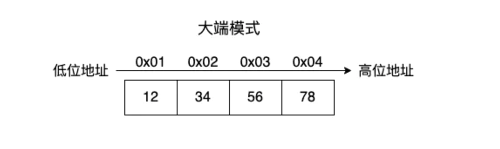

## 前言

Hi Coder，我是 CoderStar！


### CPU大小端

大端模式（Big-endian），是指数据的高字节，保存在内存的低地址中，而数据的低字节，保存在内存的高地址中(网络上一般都是采用大端模式)；大端模式符合我们阅读和书写的方式。


小端模式（Little-endian），是指数据的高字节保存在内存的高地址中，而数据的低字节保存在内存的低地址中；iOS一般是小端模式。小端模式比较符合我们人类的思维模式。

大端优点：符号位在所表示数据内存的第一个字节，便于快速判断数据的正负和大小。
小端优点：内存的低地址存放数据低字节，大数强制转换小数时效率高，直接丢弃高地址数据即可；cpu在做数值运算时依次从低到高取数运算即可，效率高效。

```c
/// 判断是大端 还是小端
int checkCPU()
{
    union w
    {
        int a;//在ios中，4 Byte
        char b;//在ios中，1 Byte
    } c;
    c.a = 1;
    return(c.b ==1);//如果c.b == 1，表示第一位是0x01，那就是小端，如果返回0，就是大端
}
```


## 最后

要更加努力呀！

Let's be CoderStar!