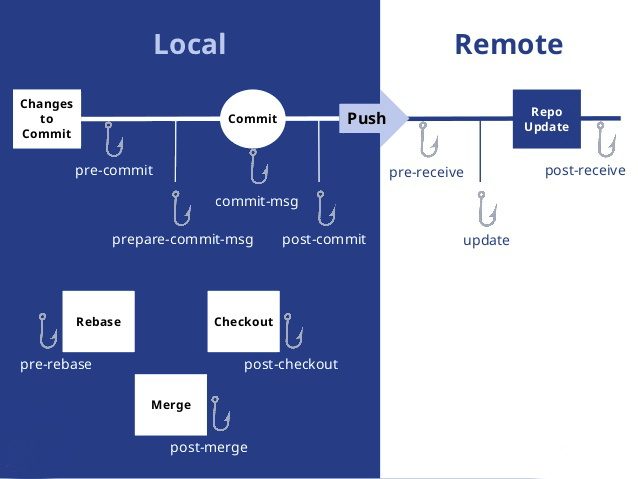

## 前言

虽然在写这篇笔记之前已经用 Git 很长时间了，而且对于一些操作也比较熟悉，但是还是感觉对于 Git 没有进行系统的学习和梳理，这篇笔记的目的其实就是把 Git 相关知识进行系统的梳理一下，让 Git 这个果子在我的技能树上成熟。

## 基本概念

在 Git 工作目录下的文件有**已跟踪**以及**未跟踪**两种状态，其中未跟踪的文件便是没有被 git 纳入版本控制的文件，而已跟踪的文件肯定就是 git 纳入版本控制的文件了，纳入 git 控制的文件的状态会被分为三种：**已提交（committed）**、**已暂存 (staged)**和**已暂存 (staged)**；那么相对应的 git 便分为**工作区**、**暂存区**以及**版本库**三个部分；


## hook



**Client-Side Hooks**

* pre-commit：执行`git commit`命令时触发，常用于检查代码风格
* prepare-commit-msg：`commit message`编辑器呼起前`default commit message`创建后触发，常用于生成默认的标准化的提交说明。该钩子接收三个参数：存有当前提交信息的文件的路径、提交类型和修补提交的提交的 SHA-1 校验。
* commit-msg：开发者编写完并确认 commit message 后触发，常用于校验提交说明是否标准。钩子接收一个参数，此参数即上文提到的，存有当前提交信息的临时文件的路径。可以用来检测提交信息是否符合要求；

* post-commit：整个 git commit 完成后触发，常用于邮件通知、提醒

* post-checkout：
* pre-rebase：
* post—merge

**Server-Side Hooks**
* pre-receive：当服务端收到一个 push 操作请求时触发，可用于检测 push 的内容
* update：与 pre-receive 相似，但当一次 push 想更新多个分支时，pre-receive 只执行一次，而此钩子会为每一分支都执行一次
* post-receive：当整个 push 操作完成时触发，常用于服务侧同步、通知

## 加速

### fastgit

下载仓库

git clone https://github.com/hanleylee/dotsh.git -> git clone https://hub.fastgit.org/hanleylee/dotsh.git

下载文件

wget https://raw.githubusercontent.com/hanleylee/dotsh/main/README.md -> wget https://raw.fastgit.org/hanleylee/dotsh/main/README.md

### jsdelivr

下载文件

wget https://raw.githubusercontent.com/hanleylee/dotsh/README.md -> wget https://cdn.jsdelivr.net/gh/hanleylee/dotsh/README.md

## 命令

### 个人配置

生成 ssh 公钥

```shell
ssh-keygen -t rsa -C "1340529758@qq.com"
```

修改用户名密码

```shell
git config --global user.name "CoderStar"
git config --global user.email "1340529758@qq.com"
```

查看用户名密码

```shell
git config user.name
git config user.email
```

## 其他操作

`git pull` 强制覆盖本地文件；使用场景：打包机拉取代码进行打包。

```shell
git fetch
git reset --hard origin/branch_name
git pull
```

如果想指定某个 git 项目提交的姓名及邮箱
可以在 `.git/config`文件中

```shell
[user]
	name = CoderStar
	email = 1340529758@qq.com
```

### 上传常用流程

```shell
git init
git add *
git commit -m "first commit"
git remote add origin url 地址
git push -u origin master
```

## commit

当我们开发完一部分功能时，会提交 commit，如果这时发现对应的功能少改了一些东西，我们可以单独提一个 commit 标记这个小改动，但更推荐的做法是将这两次改动合并为同一个，对应的命令是：

git commit --amend -m "message"

## 分支

git checkout --track origin/second
该命令会在本地创建一个 second 分支用于跟踪远端的 second 分支并切换到本地 second 分支，下载多分支代码时，需要手工执行该命令以使本地分支与远程分支一一对应

`git clone -b 分支名仓库地址`
使用 Git 下载指定分支命令

`git branch -d dev`
删除分支 dev，删除之前先转到其余分支上，如果要删除的分支已经成功合并到当前分支，删除分支的操作会直接成功；如果要删除的分支没有合并到当前所在分支，则会出现提示。如果确定无须合并而要直接删除，则执行命令：`git branch -D dev` 进行强删。

git branch -m oldname newname
重命名分支， -m 不会覆盖已有分支名称，即如果名为 newname 的分支已经存在，则会提示已经存在了。如果改成 -M 就可以覆盖已有分支名称了，即会强制覆盖名为 newname 的分支，这种操作要谨慎。

在本地新建一个分支： git branch newBranch
切换到你的新分支: git checkout newBranch
创建并切换到新分支： git checkout -b newBranch
将新分支发布在 github 上： git push origin nepushwBranch
在本地删除一个分支： git branch -d newBranch
在 github 远程端删除一个分支： git push origin :newBranch (分支名前的冒号代表删除)

分支操作：
git branch 创建分支
git branch -b 创建并切换到新建的分支上
git checkout 切换分支
git branch 查看分支列表
git branch -v 查看所有分支的最后一次操作
git branch -vv 查看当前分支
git brabch -b 分支名 origin/ 分支名 创建远程分支到本地
git branch --merged 查看别的分支和当前分支合并过的分支
git branch --no-merged 查看未与当前分支合并的分支
git branch -d 分支名 删除本地分支
git branch -D 分支名 强行删除分支
git branch origin : 分支名 删除远处仓库分支
git merge 分支名 合并分支到当前分支上
git fetch origin 远程分支名: 本地分支名拉取远程分支并创建本地分支，但不会自动切换到新分支，并且这种方式不会创建映射关系
git branch -m oldName newName 修改分支名称
git branch --set-upstream-to=origin/master master 设置本地 master 分支默认对应的远程分支是 origin 下的 master 分支

git cherry-pick 相关
git cherry-pick --abort：取消当前执行的 cherry 操作

暂存操作：
git stash 暂存当前修改
git stash apply 恢复最近的一次暂存
git stash pop 恢复暂存并删除暂存记录
git stash list 查看暂存列表
git stash drop 暂存名 (例：stash@{0}) 移除某次暂存
git stash clear 清除暂存

回退操作：
git reset --hard HEAD^ 回退到上一个版本
git reset --hard ahdhs1(commit_id) 回退到某个版本
git checkout -- file (git checkout . 为撤销全部) 撤销修改的文件 (如果文件加入到了暂存区，则回退到暂存区的，如果文件加入到了版本库，则还原至加入版本库之前的状态)
git reset HEAD file （git reset 为撤销全部）撤回暂存区的文件修改到工作区

标签操作：
git tag 标签名 添加标签 (默认对当前版本)
git tag 标签名 commit_id 对某一提交记录打标签
git tag -a 标签名 -m '描述' 创建新标签并增加备注
git tag 列出所有标签列表
git show 标签名 查看标签信息
git tag -d 标签名 删除本地标签
git push origin 标签名 推送标签到远程仓库
git push origin --tags 推送所有标签到远程仓库
git push origin :refs/tags/ 标签名 从远程仓库中删除标签

常规操作：
git push origin test 推送本地分支到远程仓库
git rm -r --cached 文件 / 文件夹名字取消文件被版本控制 (应用场景：忽略已经提交到仓库里面的文件，不仅需要在.gitignore 文件中添加要忽略的文件类型，还需要通过上述命令删除已经在仓库里面的文件) 其中 -r 参数是处理文件 加上 -r 标识处理文件夹以及子文件夹
git reflog 获取执行过的命令
git log --graph 查看分支合并图
git merge --no-ff -m '合并描述' 分支名 不使用 Fast forward 方式合并，采用这种方式合并可以看到合并记录
git check-ignore -v 文件名 查看忽略规则
git add -f 文件名 强制将文件提交
git rev-parse HEAD 最近一次提交的 commit id

其他：

git pull origin master --allow-unrelated-history // 当远端仓库与本地仓库还未进行关联，并且各自都有了一定的 commit，在 remote 建立关联之后，需要使用上述代码进合并两仓库的历史，然后进行正常的 commit 以及 push

rebase 操作
git pull --rebase 当需要进行 pull 代码时候，使用这个命令，可以不生成 merge branch 的 log
git rebase --continue 当冲突问题解决之后可以使用 git add . 再使用该命令继续完成
git rebase --abort 当前的 commit 会回到 rebase 操作之前的状态
git rebase -i [startpoint] [endpoint]  将几个 commit 合并成同一个 commit // 这里的区间是一个前开后闭的区间。
git rebase -i head~3 合并 head 以下的 3 条 commits(包含 head)

log 操作
git log [<options>] [<since>..<until>] [[--] <path>...]
git log -n 1 最后一次提交的 commit
—pretty＝：使用其他格式显示历史提交信息，可选项有：oneline,short,medium,full,fuller,email,raw 以及 format:<string>, 默认为 medium，如：
--pretty=oneline：一行显示，只显示哈希值和提交说明（--online 本身也可以作为单独的属性）
--pretty=format:" "：控制显示的记录格式，如：
%H 提交对象（commit）的完整哈希字串
%h 提交对象的简短哈希字串
%T 树对象（tree）的完整哈希字串
%t 树对象的简短哈希字串
%P 父对象（parent）的完整哈希字串
%p 父对象的简短哈希字串
%an 作者（author）的名字
%ae 作者的电子邮件地址
%ad 作者修订日期（可以用 -date= 选项定制格式）
%ar 作者修订日期，按多久以前的方式显示
%cn 提交者 (committer) 的名字
作者和提交者的区别不知道是啥？
作者与提交者的关系：作者是程序的修改者，提交者是代码提交人（自己的修改不提交是怎么能让别人拉下来再提交的？）
其实作者指的是实际作出修改的人，提交者指的是最后将此工作成果提交到仓库的人。所以，当你为某个项目发布补丁，然后某个核心成员将你的补丁并入项目时，你就是作者，而那个核心成员就是提交者（soga）
%ce 提交者的电子邮件地址
%cd 提交日期（可以用 -date= 选项定制格式）
%cr 提交日期，按多久以前的方式显示
%s 提交说明
带颜色的 --pretty=format:" "，这个另外写出来分析
以这句为例：%Cred%h%Creset -%C(yellow)%d%Cblue %s %Cgreen(%cd) %C(bold blue)<%an>
它的效果是：

先断句：［%Cred%h］［%Creset  -］［%C(yellow)%d ］［%Cblue%s］［%Cgreen(%cd)］［%C(bold blue)<%an>］
然后就是很明显能得到的规律了
一个颜色＋一个内容
颜色以％C 开头，后边接几种颜色，还可以设置字体，如果要设置字体的话，要一块加个括号
能设置的颜色值包括：reset（默认的灰色），normal, black, red, green, yellow, blue, magenta, cyan, white.
字体属性则有 bold, dim, ul, blink, reverse.
内容可以是占位元字符，也可以是直接显示的普通字符
