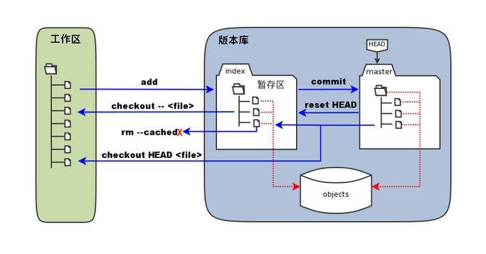

## 一、前言

虽然在写这篇笔记之前已经用 Git 很长时间了，而且对于一些操作也比较熟悉，但是还是感觉对于 Git 没有进行系统的学习和梳理，这篇笔记的目的其实就是把 Gi 相关知识进行系统的梳理一下，让 Git 这个果子在我的技能树上成熟。  
[整理的 Git 命令](/download/git相关命令.docx)

## 二、基本概念

在 Git 工作目录下的文件有**已跟踪**以及**未跟踪**两种状态，其中未跟踪的文件便是没有被 git 纳入版本控制的文件，而已跟踪的文件肯定就是 git 纳入版本控制的文件了，纳入 git 控制的文件的状态会被分为三种：**已提交（committed）**、**已暂存(staged)**和**已暂存(staged)**；那么相对应的 git 便分为**工作区**、**暂存区**以及**版本库**三个部分；



```

```
