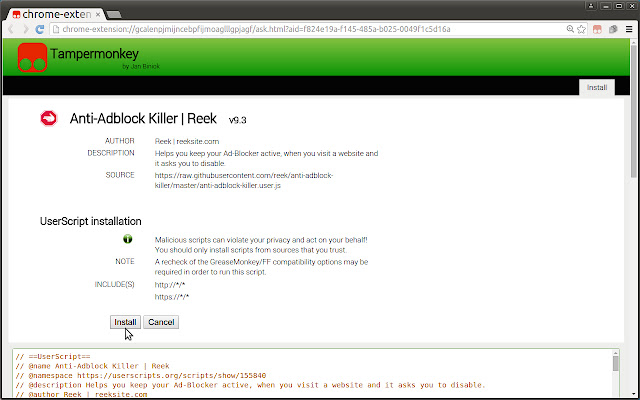
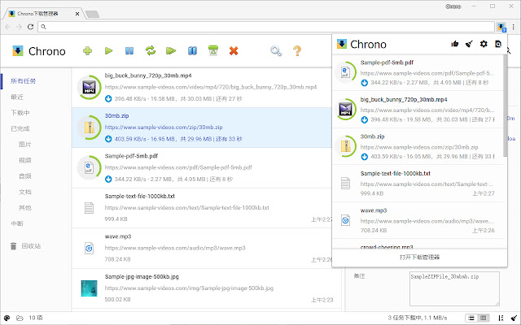
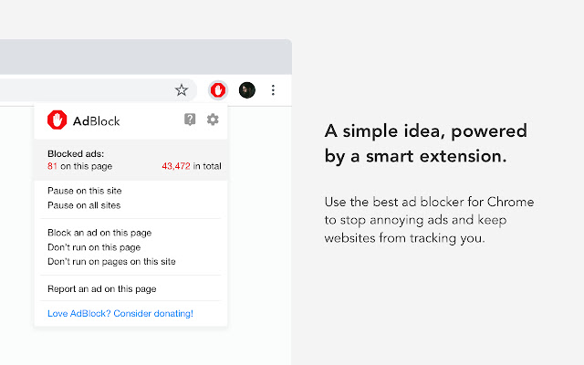
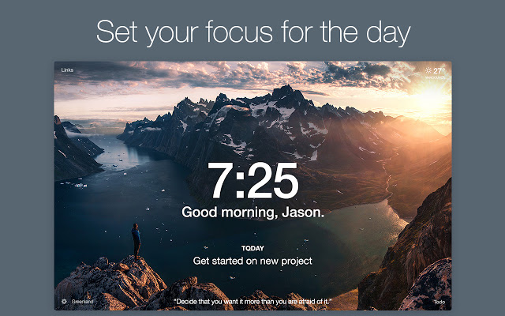
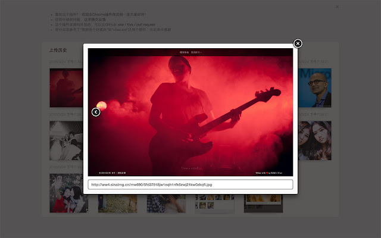
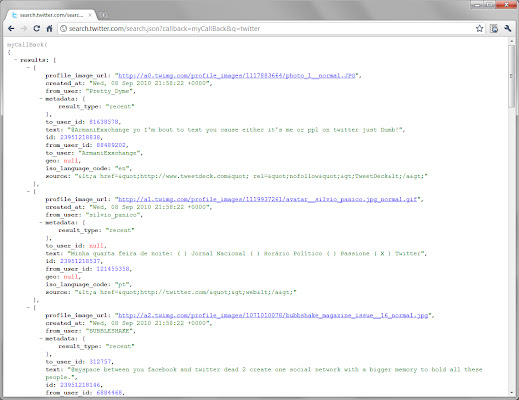
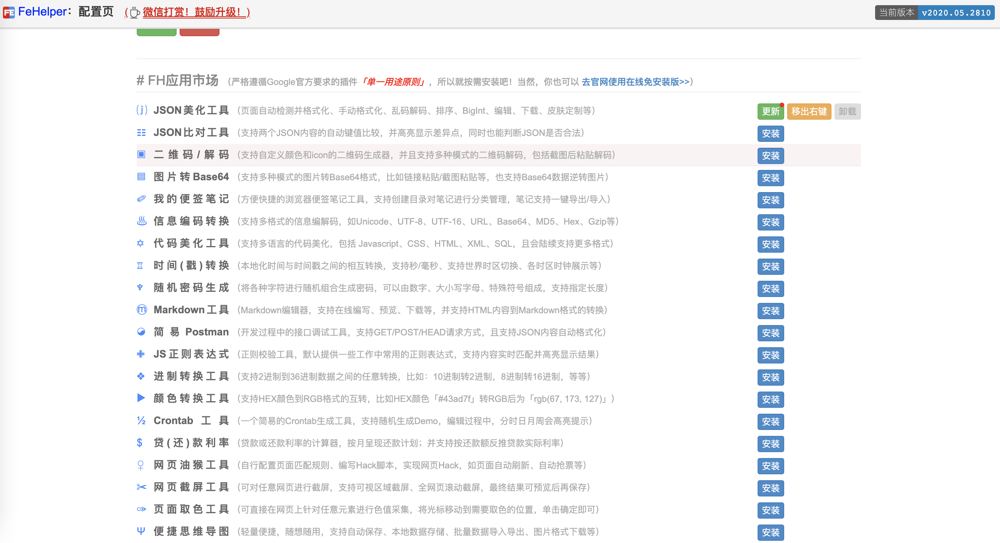
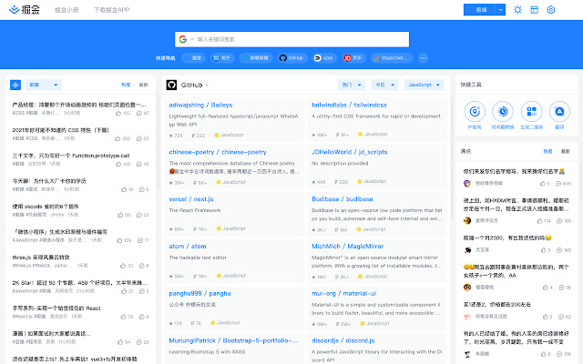

## 前言

Hi Coder，我是 CoderStar！

上次给大家推荐了一波[Mac效率软件](../Mac效率软件)，大家都说软件都很不错，但就是有一个问题

软件有了，请问 Mac 电脑找谁领？ 这...

我是一个重度的 Chrome 使用者，还是给大家带来一波好用的 Chrome 插件吧，都是我自己亲身使用过觉得不错的，推荐给大家。

嗯......，这下不用领 Mac 了吧。

## 日常类

### Tampermonkey

Tampermonkey（油猴）是最受欢迎的浏览器扩展之一，拥有超过 1000 万用户，绝对算是 Chrome 最强大的扩展了。

其中脚本可前往[Greasy Fork](https://greasyfork.org/zh-CN/scripts?sort=total_installs)获取。这个脚本中不乏有去广告、网页限制去除等功能。

### Chrono

Chrome 有自己默认的下载器，但是功能太过简单。Chrono 下载管理器是 Chrome™浏览器下第一款也是唯一一款功能全面的下载管理工具。

### OneTab

Chrome 占用内存高已经是一个不争的事实。OneTab 节省高达 95％的内存，并减轻标签页混乱现象。

### AdBlock：广告拦截

AdBlock 是最好的广告拦截工具，拥有超过 6500 万用户，也是最受欢迎的 Chrome 扩展程序之一，下载量超过 3.5 亿次！

### Awesome Screenshot 截图与录屏

截图和录屏 2 合 1 的工具，支持截取整个页面，快速分享屏幕。
超级截图录屏大师是一款录屏神器，也是一款截屏神器．屏幕截图 & 图片编辑，屏幕录像＆视频编辑，所有这些截图，录屏功能，都被一气呵成的集成到插件和对应的网站服务中。

### 二维码生成器 (Quick QR)

Chrome 上好评率最高的二维码生成器：可以方便地把当前页面转化成二维码，也可以把网页上任何文本或链接，甚至是您输入的任意内容都转化成二维码。

不过新版本的 Chrome 在网址输入框尾部自带了生成二维码功能。

### Fatkun 智能下载器

Fatkun 智能下载器可高效实现下载管理，网页图片，视频，音频等内容的嗅探和下载，同时扩展集成多个网站的智能脚本，快速提取你想要的内容。

### Momentum

用包含待办事项、天气和灵感的个人仪表板替换新标签页。一句话，就是让新标签页更好看。

### 新浪微博图床

简单好用的新浪微博图床, 支持选择 / 拖拽 / 粘贴上传图片, 并生成图片地址,HTML,UBB 和 Markdown 等格式, 支持浏览和删除历史记录

## Github 相关

### Octotree

增强 GitHub 代码审查和探索的浏览器扩展，非常建议大家安装，浏览 Github 项目时不要太爽！

### GitHub 黑暗主题

基于 Atom One Dark 的适用于所有 GitHub 的深色主题。

### Sourcegraph

向 GitHub、GitLab 和其他主机添加代码智能：悬停、定义、引用，适用于 20 多种语言。就是让我们可以不使用 IDE 来快速查看代码之间的关系

### GitZip for github

可以将 github 仓库的子目录和文件压缩成 zip 下载。

### Enhanced GitHub

显示存储库大小、每个文件的大小、下载链接和复制文件内容的选项。

## 工具类

### JSONView

当我们通过浏览器访问接口返回 JSON 数据时，JSONView 可以帮助我们自动将 JSON 格式化，方便展示，并带有折叠、高亮等功能。

### Web Developer

用过 Chrome 浏览器调试 Web 的都应该用过自带的 DevTools 工具，而 Web Developer 插件则又增强了一些功能，比如禁 Javascript，禁插件，编辑 css，cookie，form 等。

### Postman

这个相信大家都知道，我就不介绍了。

### FeHelper Web 前端助手

FE 助手：包括 JSON 格式化、二维码生成与解码、信息编解码、代码压缩、美化、页面取色、Markdown 与 HTML 互转、网页滚动截屏、正则表达式、时间转换工具、编码规范检测、页面性能检测、Ajax 接口调试、密码生成器、JSON 比对工具、网页编码设置、便签笔记等功能。

### 掘金

摸鱼神器，那当然是开玩笑的！
官方答案应该是：**为程序员、设计师、产品经理每日发现优质内容。**

## 最后

最后，祝大家周末愉快！

Let's be CoderStar!
