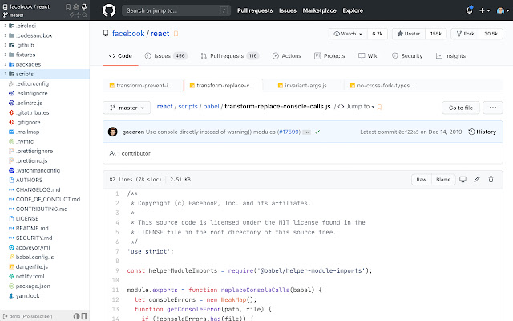
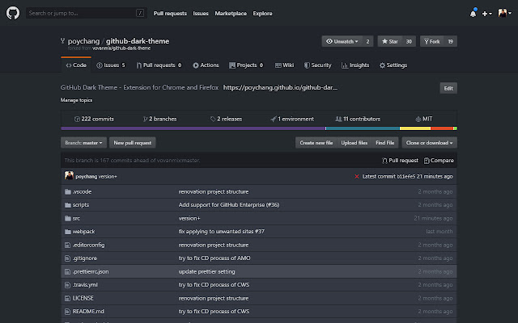
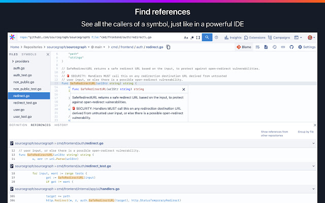
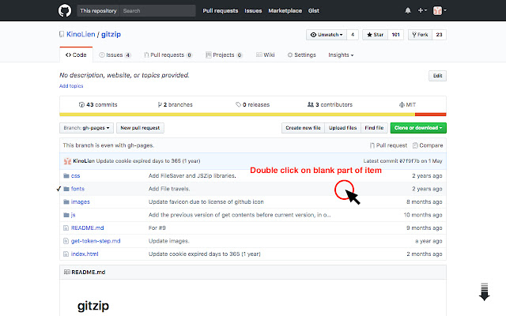

## Chrome 插件

### Octotree

增强 GitHub 代码审查和探索的浏览器扩展，非常建议大家安装，浏览 Github 项目时不要太爽！

### GitHub 黑暗主题

基于 Atom One Dark 的适用于所有 GitHub 的深色主题。

### Sourcegraph

向 GitHub、GitLab 和其他主机添加代码智能：悬停、定义、引用，适用于 20 多种语言。就是让我们可以不使用 IDE 来快速查看代码之间的关系

### GitZip for github

可以将 github 仓库的子目录和文件压缩成 zip 下载。

### Enhanced GitHub

显示存储库大小、每个文件的大小、下载链接和复制文件内容的选项。

## 在线工具

### DownGit

下载 github 仓库指定文件或文件夹

[DownGit](https://minhaskamal.github.io/DownGit/#/home)

## 装扮

### shields

[网址](https://shields.io/)

通过图标方式表示项目的相关信息，也可以自定义图标，如下所示

### github-readme-stats

[网址](https://github.com/anuraghazra/github-readme-stats/blob/master/docs/readme_cn.md)

在你的 README 中获取动态生成的 GitHub 统计信息！如下所示

### visitor

[网址](https://visitor-badge.glitch.me/#docs)

统计 README.md, Issues, PRs 等访问人数。如下所示

### gitmoj

[网址](https://gitmoji.js.org/)

git 提交信息的 emoji 指南

### resume

[网址](https://resume.github.io)

根据你的 github 信息为你生成一份在线简历，如下所示

[Coder-Star的简历](https://resume.github.io/?Coder-Star)

### githistory

将github某个文件链接前的github域名换为 `github.githistory.xyz` 便可以一个图形化的方式显示该文件的修改历史，如下所示。

[CSPickerView.podspec变动历史](https://github.githistory.xyz/Coder-Star/CSPickerView/blob/main/CSPickerView.podspec)

### github 提供的 api

https://api.github.com/
