## 前言

使用 Mac 开发也有几个年头了，积累了一些效率工具和开发工具，今天整理了一下并分享给大家，工具几乎都是开源免费的，也期待大家有更多好的工具推荐给我，我补充上去。

## 包管理器

### [Homebrew](https://brew.sh/)

Homebrew 是一款 Mac OS 平台下的软件包管理工具，拥有安装、卸载、更新、查看、搜索等很多实用的功能。算是 Mac 系统的必备环境了。

有了它，比如你要下载下面提到的 node 环境，你根本不用考虑 node 去哪个地方下，只需要执行`brew install node`命令就好。

如果大家不习惯使用命令操作，还可以使用这款可视化的工具[cakebrew](https://www.cakebrew.com/)。

### [Npm](https://nodejs.org/en/)

Npm 其实是 Node.js 的包管理工具，安装 Node 后就会有 npm 环境了。有很多 npm 包是很好的工具，以我经常用的一个举例吧

#### [anywhere](https://www.npmjs.com/package/anywhere)

它可以随时随地将你的当前目录变成一个静态文件服务器的根目录，只需要你在当前目前下执行一个`anywhere`命令。

这样就实现了**一个局域网**下，文件互传的功能，我经常使用它来和同事之间传递文件，毕竟内网传递速度就是快。

### [Gem](https://rubygems.org/)

Gem 是 Ruby 模块的包管理器。如果你是 iOS 开发者，对这个一定不会陌生，因为 CocoaPods 本身就是一个 ruby 模块，我们可以通过 gem 来安装 CocoaPods，当然还可以通过 Homebrew 来安装。

## 日常工具

### [Snipaste](https://zh.snipaste.com/)

最好用的截图工具，我要向大家强烈安利它，不仅有正常的截图、编辑等功能，还有一个其他软件都没有而且我经常用的功能 -- 贴图，可以直接将图片像便签一样贴在桌面上。

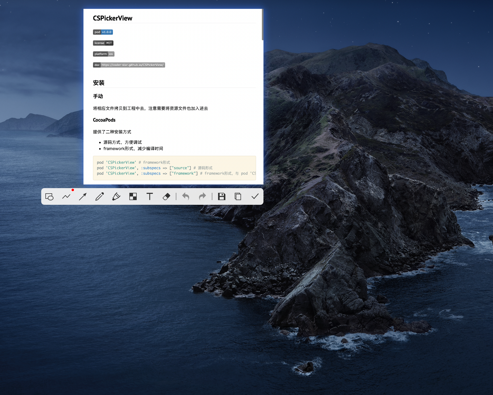

### [MWeb](https://zh.mweb.im/)

专业的 Markdown 写作、记笔记、静态博客生成软件，用起来真的比较方便，其实还会有朋友推荐 Typora 这款软件，但是我不太喜欢那种预览区和编辑区在一起的方式，如果对 Typora 有兴趣的，也可以去看看。

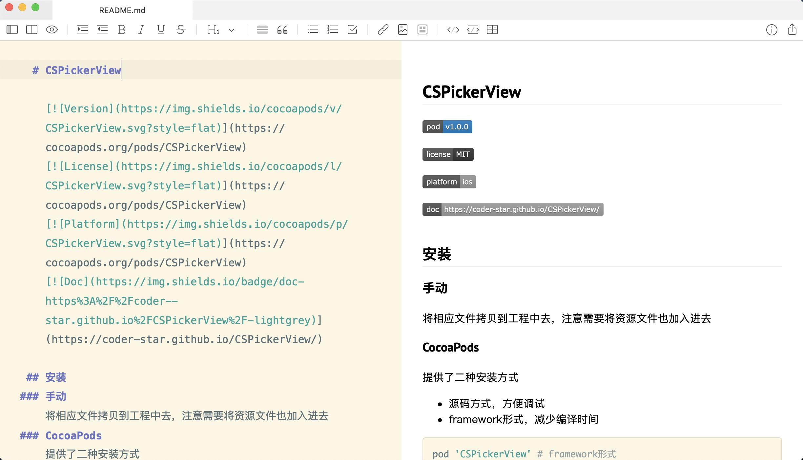

### [PicGo](https://github.com/Molunerfinn/PicGo)

写博客的时候少不了需要放上一些图片，PicGo 是一个很好的图床工具软件，可配置多种图床存储位置，github、云服务器等，还支持插件。
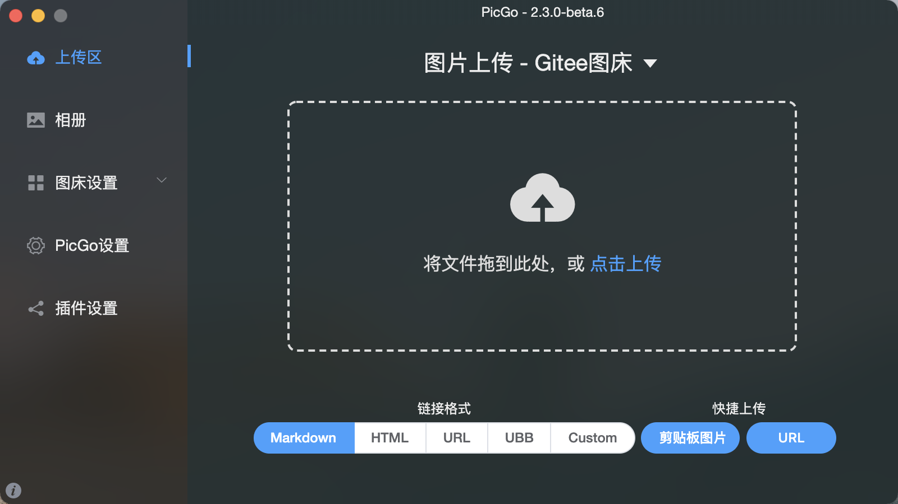

### [Go2Shell](https://zipzapmac.com/Go2Shell)

Go2Shell 可以让 Finder 中打开一个指向当前目录的终端窗口。

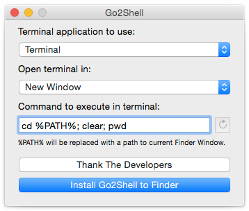

### [Parallel Desktop](https://www.parallels.cn/)

Mac 上的虚拟机软件，有的软件没有 Windows 版本，或多或少需要一个虚拟机安装其他系统。

我有的时候会通过这种方式从 Mac 电脑向 Mac 不支持写的硬盘中拷贝文件。

### [Mircrosoft Remote Desktop](https://www.microsoft.com/en-us/download/details.aspx?id=50042)

微软官方免费远程桌面控制 Windows 的软件，我之所以用这款软件，是因为我上家公司服务器系统是 Windows Server 的，如果也有类似需求或者需要远程 Windows 系统的读者，可以看看这款软件。

### [Remote Desktop - VNC](https://apps.apple.com/cn/app/remote-desktop-vnc/id472995993?mt=12)

远程连接 Mac 的工具。我只所以用这款软件，是因为我前不久需要连接 Mac Mini 做一些 iOS 自动化打包的事情，有类似需求的读者，可以看看这款软件。

### [Stretchly](https://github.com/hovancik/stretchly)

这是一款休息时间提醒应用，非常适合我们程序员这类写 Bug 时聚精会神，忘记起来活动活动的职业。
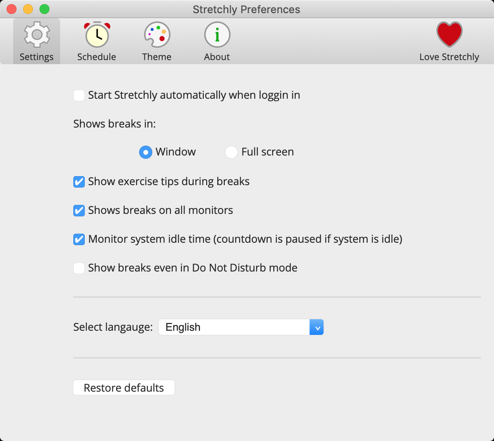

### [Alfred](https://www.alfredapp.com/)

这个我觉得根本无需介绍，神器，使用 macOS 的同学应该都知道。一句话来说就是，Alfred 是 macOS 上神级的效率应用，能够在实际操作中大幅提升工作效率。

### [uTools](https://u.tools/)

生产力工具集

### [SwitchHosts](https://swh.app/zh/)

是一个管理、切换多个 hosts 方案的可视化工具。

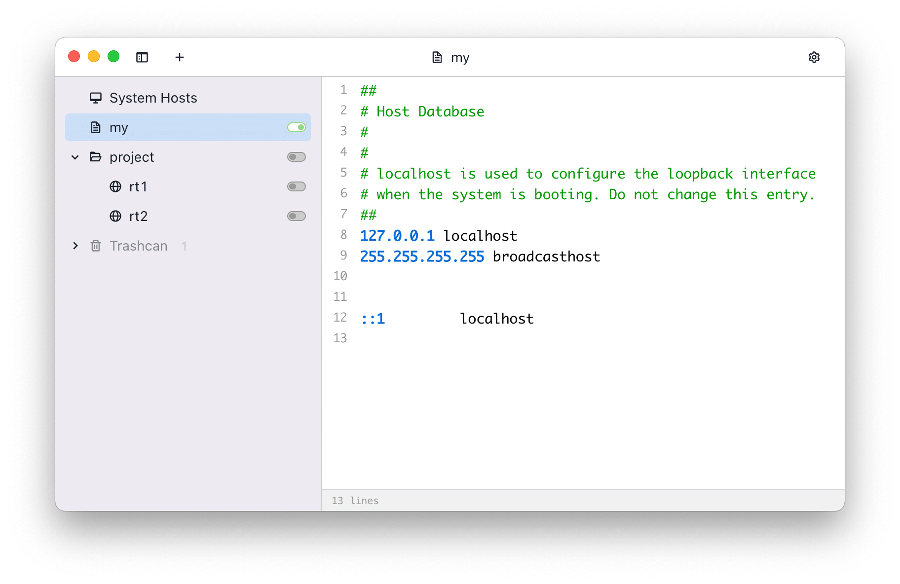

### [ezip](https://ezip.awehunt.com/)

Mac 文件解压缩工具。

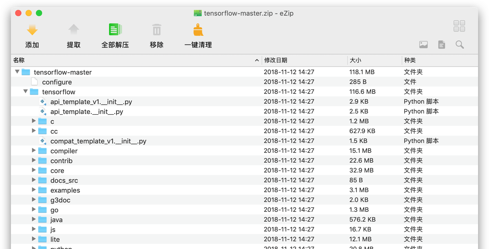

### [Dozer](https://github.com/Mortennn/Dozer)

一款免费的 Mac 菜单栏图标隐藏软件，开启软件后，在 Mac 菜单栏会出现两个小圆点，将两个小圆点拖拽至你需要隐藏的应用图标的右边，点击第二个小圆点，便能完成隐藏。

### [fliqlo](https://fliqlo.com/)

翻页时钟屏保软件

## 开发工具

### [Sourcetree](https://www.sourcetreeapp.com/)

Sourcetree 是我用过最好用的版本管理（Git）客户端软件。

### [Charles](https://www.charlesproxy.com/)

非常优秀的抓包工具

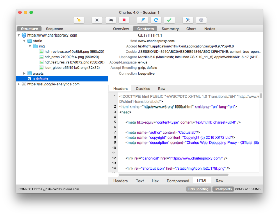

### [iTerm2](https://iterm2.com/)

`iTerm2` + `Oh My Zsh `可以实现命令自动补全、自定义主题等等功能，强烈推荐，相关安装教程有很多，可以自己去找找。

只上一张效果图，大家感受一下吧
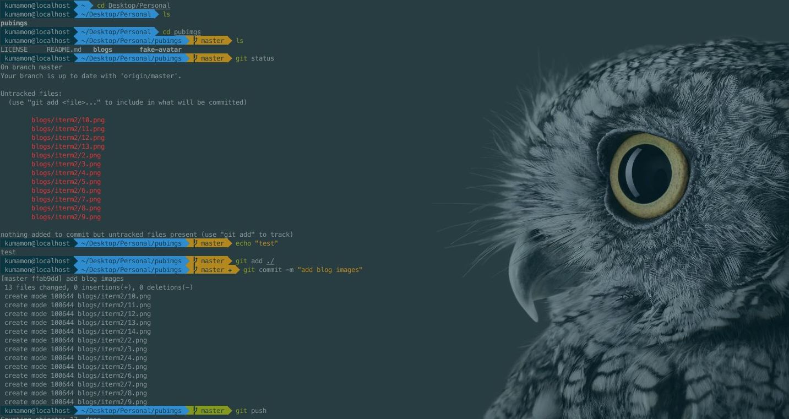

### [Postman](https://www.postman.com/downloads/)

接口测试工具，如果不想安装软件，也可以安装谷歌浏览器扩展。

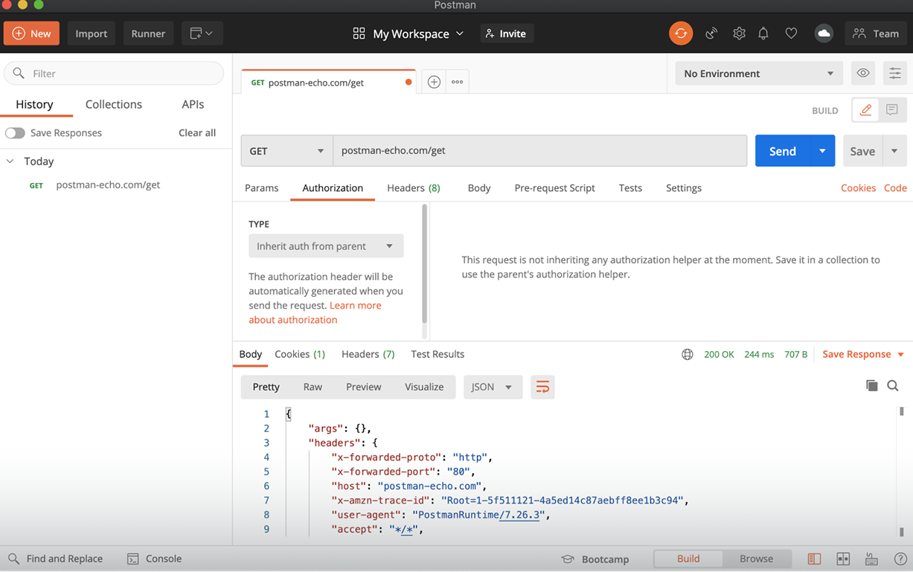

### [FinalShell](http://www.hostbuf.com/)

FinalShell 是一体化的的服务器，网络管理软件，不仅是 ssh 客户端，还是功能强大的开发，运维工具，充分满足开发，运维需求。

国人开发的 SSH 客户端工具，亲验好用。

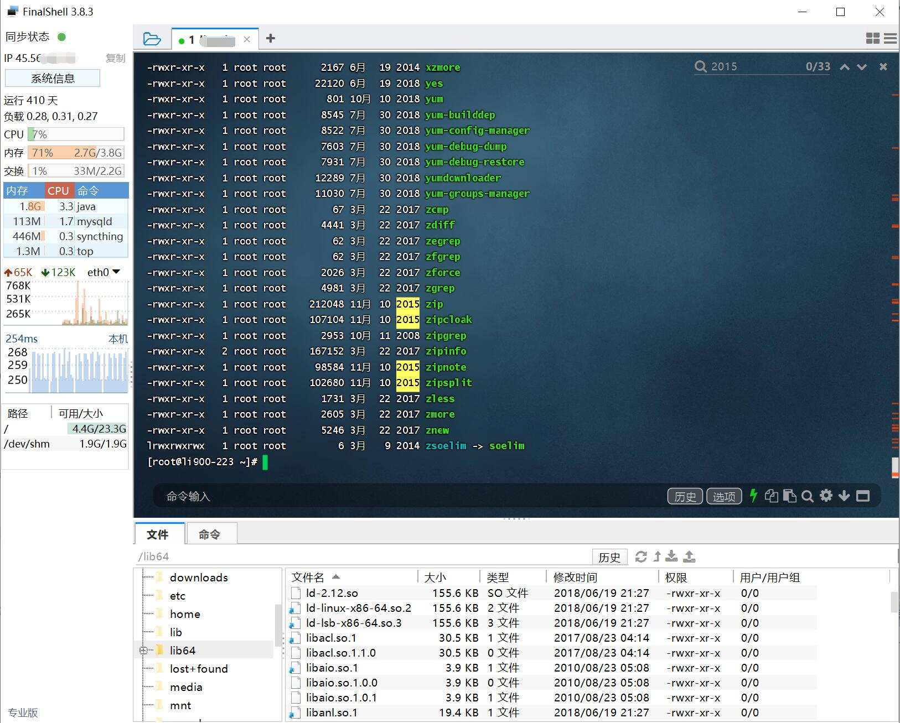

## iOS 工具

### [JSONConverter](https://github.com/iosyaowei/JSONConverter)

JSONConverter 是 MAC 上 iOS/Flutter 开发的辅助工具，可以快速的格式化 JSON 数据并转换生成对应的模型类属性，目前支持 Objective-C、Swift、Flutter 以及目前流行的第三方库：SwiftyJSON、HandyJSON，ObjectMapper, 可以灵活选择构建 class/struct，并支持配置类名前缀等，省去手敲模型的麻烦，借此提高开发效率。

### [LSUnusedResources](https://github.com/tinymind/LSUnusedResources)

用于在 Xcode 项目中查找未使用的图像和资源。

### [BuildTimeAnalyzer](https://github.com/RobertGummesson/BuildTimeAnalyzer-for-Xcode)

展示 Swift 编译构建时间。

### [ImageOptim](https://imageoptim.com/mac)

图片压缩工具

[ImageOptim-CLI](https://github.com/JamieMason/ImageOptim-CLI)：Mac 可使用`brew install imageoptim-cli`安装，其会根据你的指定，选择性调用 `JPEGmini`、`ImageAlpha`、`ImageOptim` 等工具，实现中间过程自动化。

### [iSpart](http://isparta.github.io/)

iSparta 是一款 APNG 和 Webp 转换工具。

* [webp工具](https://developers.google.com/speed/webp/docs/using): 在Mac下，可以使用Homebrew安装WebP工具--`brew install webp`；

### [Lookin](https://lookin.work/)

Lookin 可以查看与修改 iOS App 里的 UI 对象，类似于 Xcode 自带的 UI Inspector 工具，或另一款叫做 Reveal 的软件。但借助于“控制台”和“方法监听”功能，Lookin 还可以进行 UI 之外的调试。此外，虽然 Lookin 主体是一款 macOS 程序，它亦可嵌入你的 iOS App 而单独运行在 iPhone 或 iPad 上。最后，Lookin 完全免费。

### [LinkMap](https://github.com/huanxsd/LinkMap)

这个工具是专为用来分析项目的 LinkMap 文件，得出每个类或者库所占用的空间大小（代码段 + 数据段），方便开发者快速定位需要优化的类或静态库。

### [SwiftFormat For Xcode](https://github.com/nicklockwood/SwiftFormat)

SwiftFormat 是一个代码库和命令行工具，用于在 macOS 或 Linux 上重新格式化 Swift 代码。

### [Hopper](https://www.hopperapp.com/)

逆向工程工具，可让您反汇编、反编译和调试应用程序。

### [iTools](https://pro.itools.cn/pro_mac/)

这个只要是做 iOS 开发的应该都知道，我就不过多介绍了。

### [Network Link Conditioner](https://developer.apple.com/downloads/?q=Hardware%20IO%20Tools)

这是一个来自苹果官方的工具，它可以模拟任何网络环境，如 3G，Edge 等等，也可以重新定义当前的网络环境，如网络延迟、带宽或丢包率。

### [XSimulatorMngr](https://github.com/xndrs/XSimulatorMngr)

XCode 模拟器管理器，用于管理 iOS 模拟器的开发者工具。
* 已安装的模拟器列表。
* 每个模拟器已安装的开发者应用程序列表。
* 允许直接打开应用程序包或沙箱文件夹。

### [Knuff](https://github.com/KnuffApp/Knuff)

Apple 推送通知服务 (APN) 的调试应用程序

### [InjectionIII](http://injectionforxcode.johnholdsworth.com/)

允许您在 iOS **模拟器**中增量更新函数和类、结构或枚举的任何方法的实现，而无需重新构建或重新启动应用程序。

### [DoKit](https://www.dokit.cn/#/index/home)

滴滴推出的 APP 效率工具

### [ProfilesManager](https://github.com/shaojiankui/ProfilesManager/releases)

mobileprovision 文件管理器工具

### [AssetCatalogTinkerer](https://github.com/insidegui/AssetCatalogTinkerer)

一个应用程序，可让您打开。car 文件并浏览 / 提取其图像，或使用 QuickLook 在 Finder 上预览它们

### cocoapods 依赖关系可视化

安装`cocoapods-dependencies`工具，在`Podfile`文件路径下执行`pod dependencies`在控制台就会输出级联的依赖关系。

安装`cocoapods-dependencies`： `gem install cocoapods-dependencies`

这样的方式输出的依赖关系不直观，我们可以安装`graphviz`工具将这些依赖关系生成为`.gz`文件，并且也可以生成依赖图；

* 安装`graphviz`：`brew install graphviz`
* 生成`.gz`文件：`pod dependencies --graphviz`
* 生成依赖图：`pod dependencies --image`
* 生成`.gz`文件及依赖图：`pod dependencies --graphviz --image`

`.gz`文件其实就是一种描述图形的文件，我们可以通过其他的工具去解析它，比如：
* 在线网站：[GraphvizOnline](http://dreampuf.github.io/GraphvizOnline)
* vs 插件：Graphviz (dot) language support for Visual Studio Code

### 其他工具

* [FengNiao](https://github.com/onevcat/FengNiao.git)：找出未使用的图片资源，命令行工具，可嵌入到Run Script中或者在CI系统中使用，支持的模式匹配更加强大；
* [Duplicate Photos](https://www.duplicatephotocleaner.com/)：从内容上检测重复/相似图片；
* [fdupes](https://github.com/adrianlopezroche/fdupes)：检测项目中的重复文件，其原理是对比不同文件的签名，签名相同的文件就会判定为重复资源；
* [fui](https://github.com/dblock/fui)：查找未import的.h文件；
* [dSYMTools](https://github.com/answer-huang/dSYMTools)：分析Crash

## 在线工具

### [JSON](https://www.json.cn/)

JSON 解析，用来格式化 JSON

### [tinypng](https://tinypng.com/)

在线压缩图片
[TinyPNG4Mac](https://github.com/kyleduo/TinyPNG4Mac/)：TinyPng的客户端工具，无需联网使用浏览器；

### [tableconvert](https://tableconvert.com/)

将表格转成 md，excel 等各种形式，我经常会用来写一些表格用来转成 md

### [DownGit](https://minhaskamal.github.io/DownGit/#/home)

下载 Github 仓库中某一个指定文件或者文件夹

### [swiftify](https://swiftify.com/converter/code/)

快速将 Objective-C 代码转换为 Swift

## Mac 软件网站

- [xclient](https://xclient.info/)
- [macbl](https://www.macbl.com/)
- [xxmac](https://www.xxmac.com/)
