## 前言

Hi Coder，我是 CoderStar！

## iOS 工具

### [JSONConverter](https://github.com/iosyaowei/JSONConverter)

JSONConverter 是 MAC 上 iOS/Flutter 开发的辅助工具，可以快速的格式化 JSON 数据并转换生成对应的模型类属性，目前支持 Objective-C、Swift、Flutter 以及目前流行的第三方库：SwiftyJSON、HandyJSON，ObjectMapper, 可以灵活选择构建 class/struct，并支持配置类名前缀等，省去手敲模型的麻烦，借此提高开发效率。

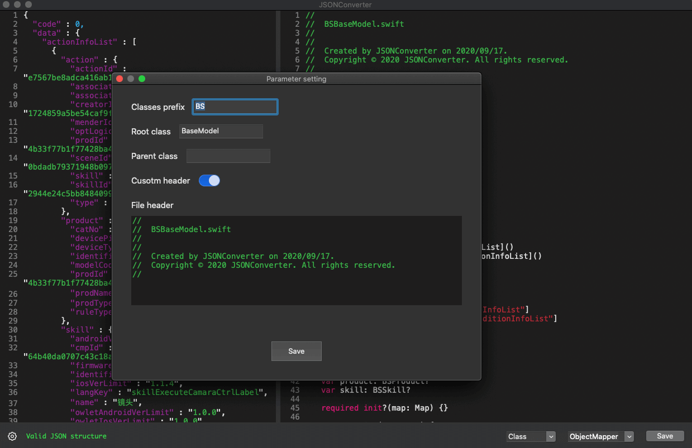

### [LSUnusedResources](https://github.com/tinymind/LSUnusedResources)

用于在 Xcode 项目中查找未使用的图像和资源。
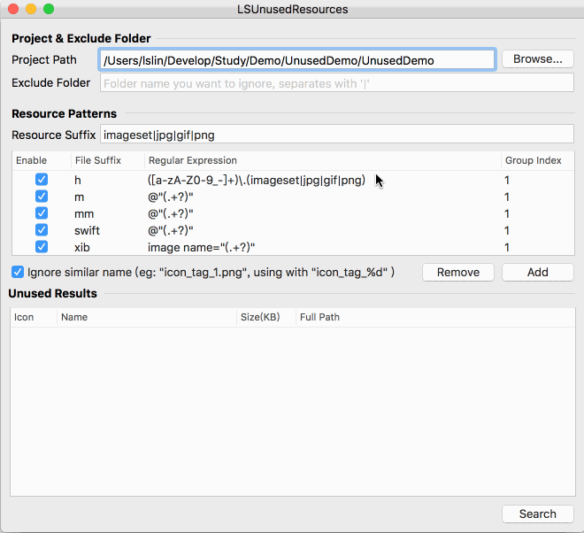

### [BuildTimeAnalyzer](https://github.com/RobertGummesson/BuildTimeAnalyzer-for-Xcode)

展示 Swift 编译构建时间。
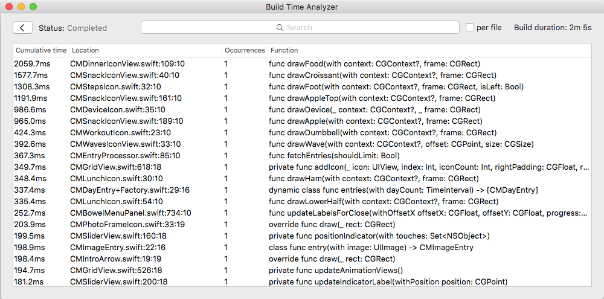

### [ImageOptim](https://imageoptim.com/mac)

图片压缩工具
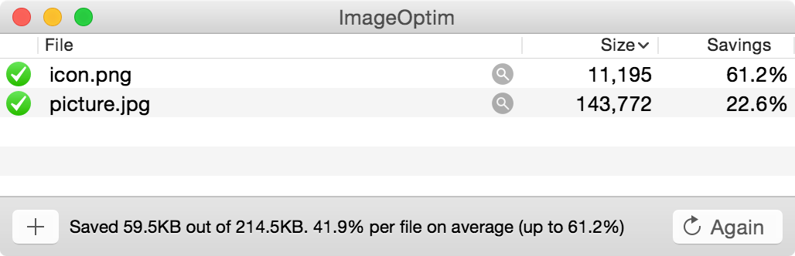
[ImageOptim-CLI](https://github.com/JamieMason/ImageOptim-CLI)：Mac 可使用`brew install imageoptim-cli`安装，其会根据你的指定，选择性调用 `JPEGmini`、`ImageAlpha`、`ImageOptim` 等工具，实现中间过程自动化。

### [iSpart](http://isparta.github.io/)

iSparta 是一款 APNG 和 Webp 转换工具。
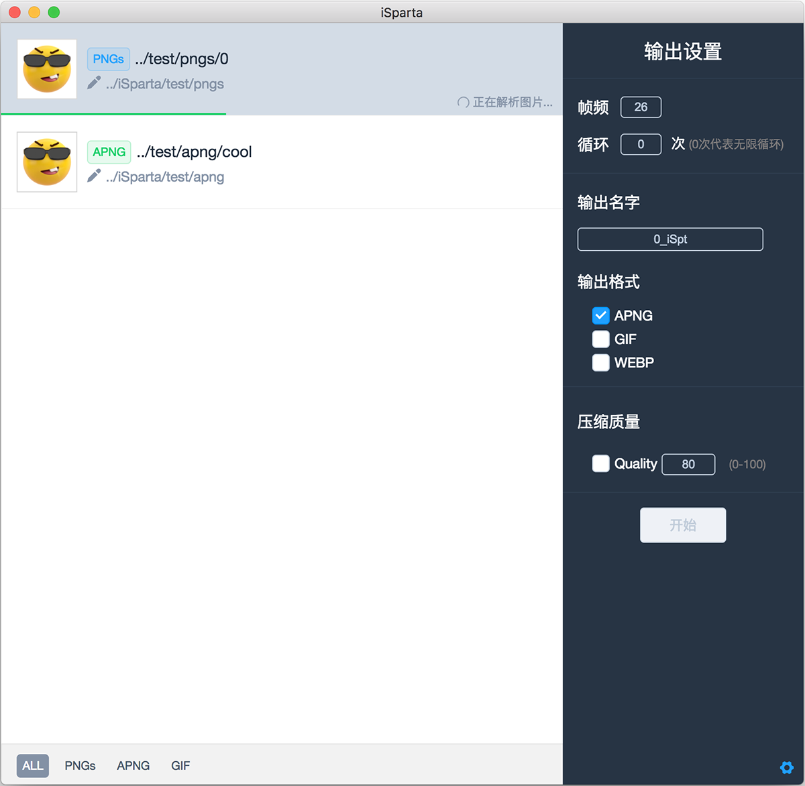

* [webp工具](https://developers.google.com/speed/webp/docs/using): 在Mac下，可以使用Homebrew安装WebP工具--`brew install webp`；

### [Lookin](https://lookin.work/)

Lookin 可以查看与修改 iOS App 里的 UI 对象，类似于 Xcode 自带的 UI Inspector 工具，或另一款叫做 Reveal 的软件。但借助于'控制台'和'方法监听'功能，Lookin 还可以进行 UI 之外的调试。此外，虽然 Lookin 主体是一款 macOS 程序，它亦可嵌入你的 iOS App 而单独运行在 iPhone 或 iPad 上。最后，Lookin 完全免费。
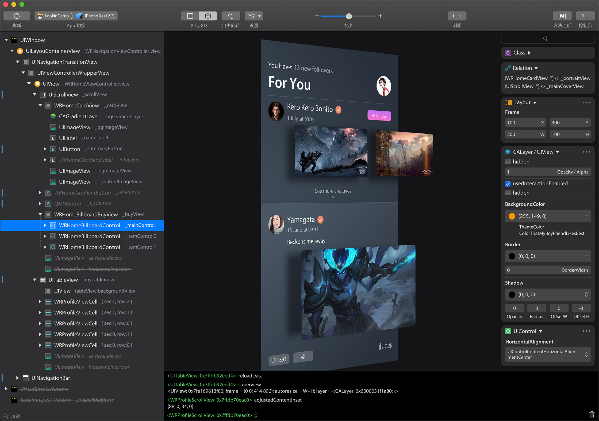

### [LinkMap](https://github.com/huanxsd/LinkMap)

这个工具是专为用来分析项目的 LinkMap 文件，得出每个类或者库所占用的空间大小（代码段 + 数据段），方便开发者快速定位需要优化的类或静态库。
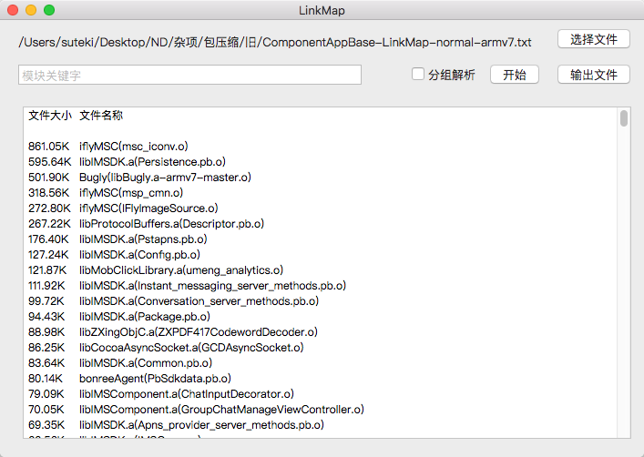

### [SwiftFormat For Xcode](https://github.com/nicklockwood/SwiftFormat)

SwiftFormat 是一个代码库和命令行工具，用于在 macOS 或 Linux 上重新格式化 Swift 代码。

### [Hopper](https://www.hopperapp.com/)

逆向工程工具，可让您反汇编、反编译和调试应用程序。

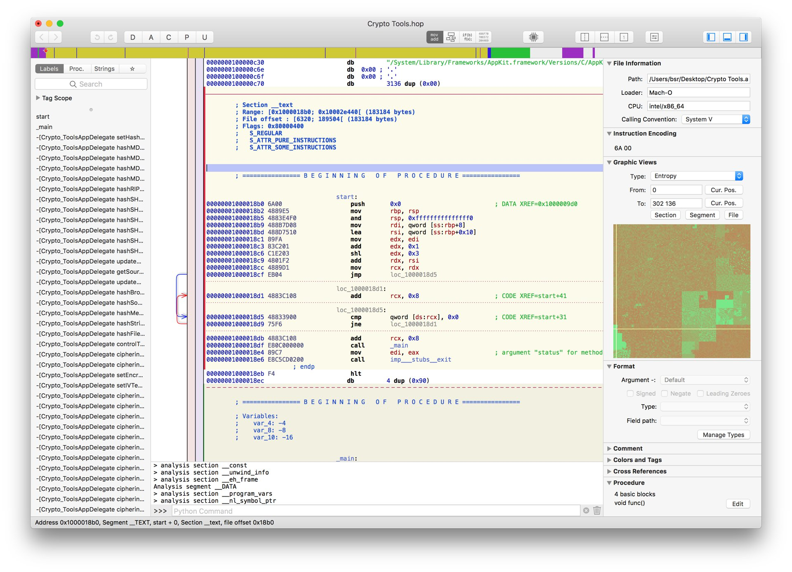

### [iTools](https://pro.itools.cn/pro_mac/)

这个只要是做 iOS 开发的应该都知道，我就不过多介绍了。

### [Network Link Conditioner](https://developer.apple.com/downloads/?q=Hardware%20IO%20Tools)

这是一个来自苹果官方的工具，它可以模拟任何网络环境，如 3G，Edge 等等，也可以重新定义当前的网络环境，如网络延迟、带宽或丢包率。

### [XSimulatorMngr](https://github.com/xndrs/XSimulatorMngr)

XCode 模拟器管理器，用于管理 iOS 模拟器的开发者工具。
* 已安装的模拟器列表。
* 每个模拟器已安装的开发者应用程序列表。
* 允许直接打开应用程序包或沙箱文件夹。

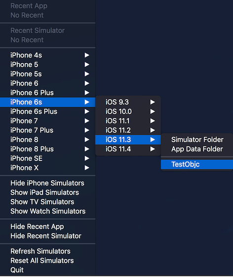

### [Knuff](https://github.com/KnuffApp/Knuff)

Apple 推送通知服务 (APN) 的调试应用程序
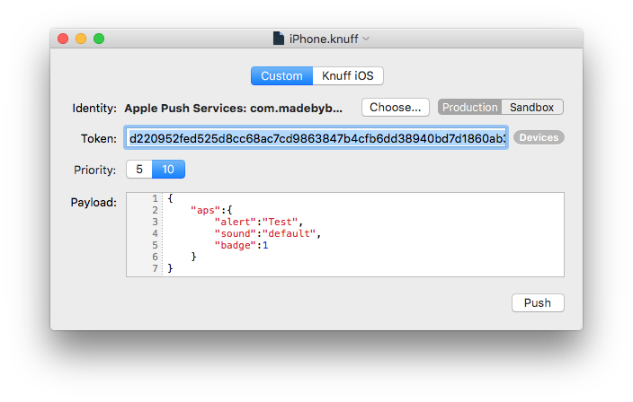

### [InjectionIII](http://injectionforxcode.johnholdsworth.com/)

允许您在 iOS **模拟器**中增量更新函数和类、结构或枚举的任何方法的实现，而无需重新构建或重新启动应用程序。
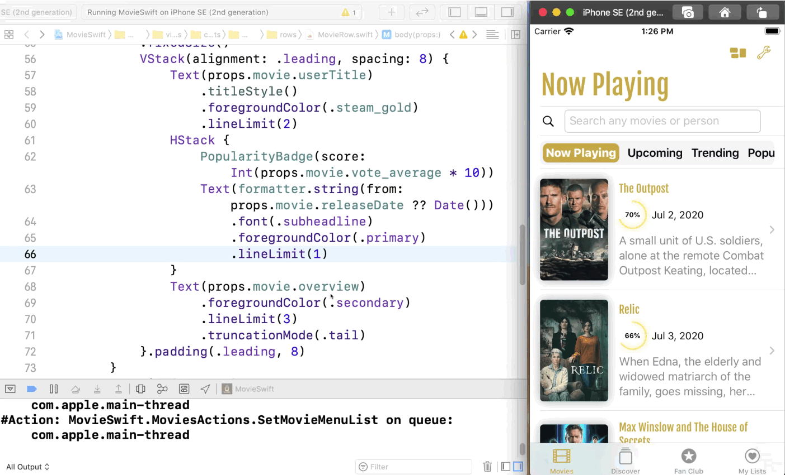

### [DoKit](https://www.dokit.cn/#/index/home)

滴滴推出的 APP 效率工具
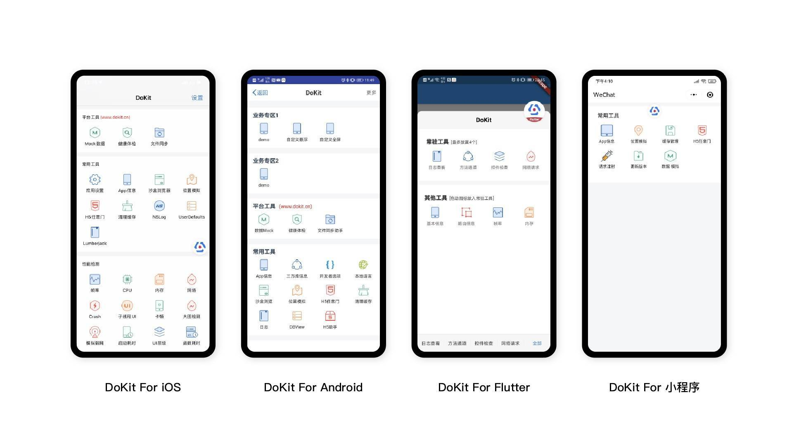

### [ProfilesManager](https://github.com/shaojiankui/ProfilesManager/releases)

mobileprovision 文件管理器工具

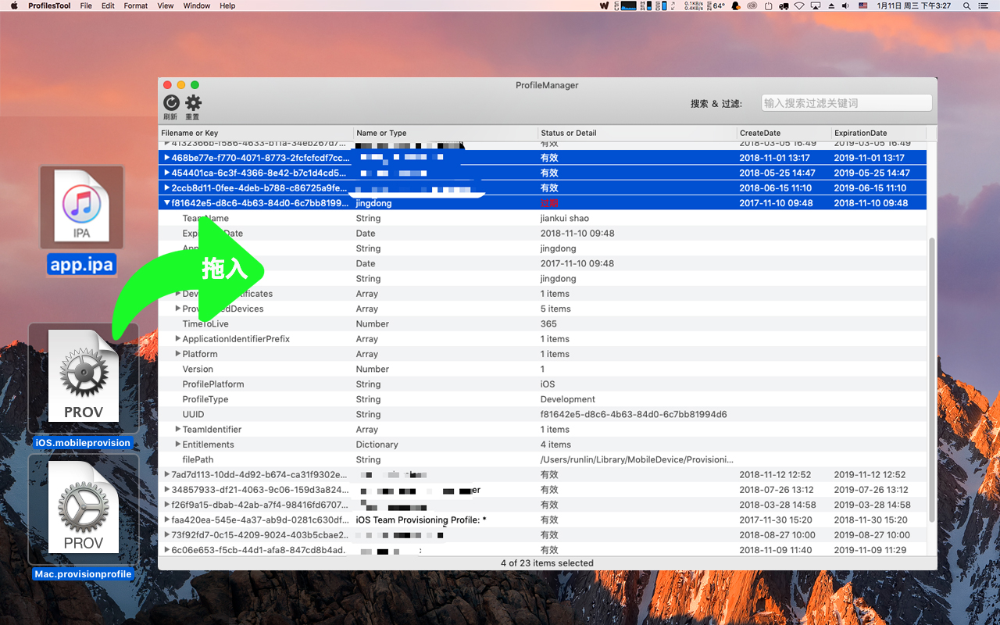

### [AssetCatalogTinkerer](https://github.com/insidegui/AssetCatalogTinkerer)

一个应用程序，可让您打开。car 文件并浏览 / 提取其图像，或使用 QuickLook 在 Finder 上预览它们
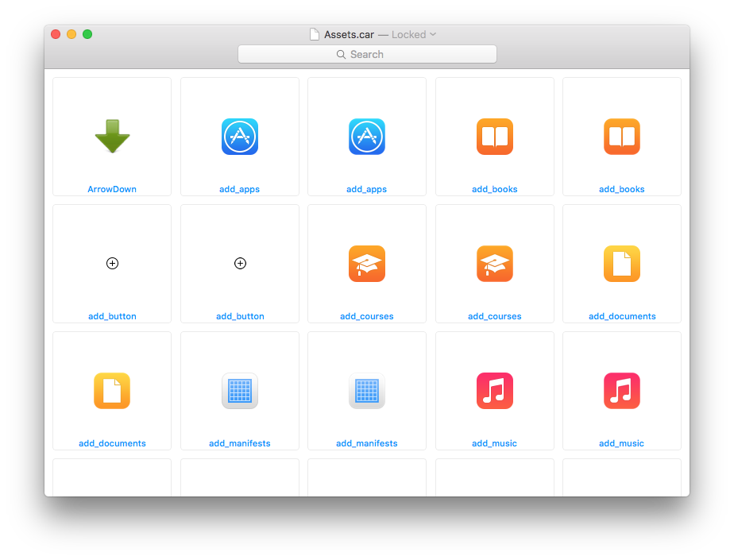

### cocoapods 依赖关系可视化

安装`cocoapods-dependencies`工具，在`Podfile`文件路径下执行`pod dependencies`在控制台就会输出级联的依赖关系。

安装`cocoapods-dependencies`： `gem install cocoapods-dependencies`

这样的方式输出的依赖关系不直观，我们可以安装`graphviz`工具将这些依赖关系生成为`.gz`文件，并且也可以生成依赖图；

* 安装`graphviz`：`brew install graphviz`
* 生成`.gz`文件：`pod dependencies --graphviz`
* 生成依赖图：`pod dependencies --image`
* 生成`.gz`文件及依赖图：`pod dependencies --graphviz --image`

`.gz`文件其实就是一种描述图形的文件，我们可以通过其他的工具去解析它，比如：
* 在线网站：[GraphvizOnline](http://dreampuf.github.io/GraphvizOnline)
* vs 插件：Graphviz (dot) language support for Visual Studio Code

### 其他工具

* [FengNiao](https://github.com/onevcat/FengNiao.git)：找出未使用的图片资源，命令行工具，可嵌入到Run Script中或者在CI系统中使用，支持的模式匹配更加强大；
* [Duplicate Photos](https://www.duplicatephotocleaner.com/)：从内容上检测重复/相似图片；
* [fdupes](https://github.com/adrianlopezroche/fdupes)：检测项目中的重复文件，其原理是对比不同文件的签名，签名相同的文件就会判定为重复资源；
* [fui](https://github.com/dblock/fui)：查找未import的.h文件；
* [dSYMTools](https://github.com/answer-huang/dSYMTools)：分析Crash

## 最后

要更加努力呀！

Let's be CoderStar!
