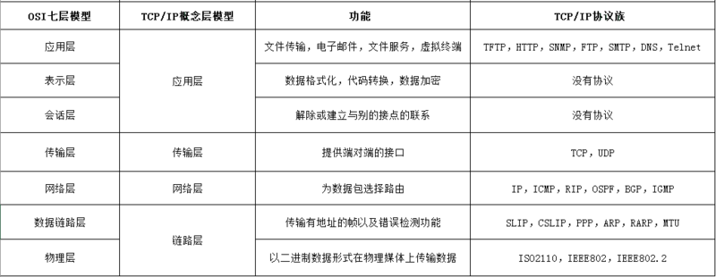

## http OSI 网络模型

## tcp 与 udp

**tcp 特点**

1. 三次握手、四次挥手
2. 滑动窗口
3. 拥塞控制

**udp 特点**

**两者区别**

1. TCP 面向连接（如打电话要先拨号建立连接）；UDP 是无连接的，即发送数据之前不需要建立连接；
2. TCP 提供可靠的服务。也就是说，通过 TCP 连接传送的数据，无差错，不丢失，不重复，且按序到达；UDP 尽最大努力交付，也不保证可靠交付；
3. TCP 面向字节流，实际上是 TCP 把数据看成一连串无结构的字节流；UDP 是面向报文的；
4. UDP 没有拥塞控制，因此网络出现拥塞不会使源主机的发送速率降低（对实时应用很有用，如 IP 电话，实时视频会议等）；
5. 每一条 TCP 连接只能是点到点的；UDP 支持一对一，一对多，多对一和多对多的交互通信；
6. TCP 首部开销 20 字节；UDP 的首部开销小，只有 8 个字节；
7. TCP 的逻辑通信信道是全双工的可靠信道，UDP 则是不可靠信道；

## http

method 种类

- OPTIONS 预检请求
- GET 向特定的资源发出请求
- HEAD 与 get 请求类似，不同的是不返回方法体里面的相关信息
- POST 向指定资源提交数据进行处理请求，数据被包含在请求体中。POST 请求可能会导致新的资源的创建和/或已有资源的修改，多用于新增
- PUT 向指定资源位置上传其最新内容，用于更新
- DELETE 请求服务器删除 Request-URI 所标识的资源
- TRACE 回显服务器收到的请求，主要用于测试或诊断
- CONNECT HTTP/1.1 协议中预留给能够将连接改为管道方式的代理服务器

在实际应用中，常用的是`GET`、`POST`、`PUT`、`DELETE`这四种方法，分别对应查、增、改、删。

头信息种类

- Content-Type: 返回内容的媒体类型，下面只列举几个常用的

  - multipart/form-data 上传文件时
  - application/json JSON 数据格式
  - text/html HTML 格式
  - application/octet-stream 二进制流数据，文件下载时使用

- Accept: 允许哪些媒体类型。
- Accept-Charset: 允许哪些字符集。
- Accept-Encoding: 允许哪些编码。
- Accept-Language: 允许哪些语言。
- Authorization： 当客户端接收到来自 WEB 服务器的 WWW-Authenticate 响应时，该头部来回应自己的身份验证信息给 WEB 服务器。
- Cache-Control:

  请求：

  - no-cache（不要缓存的实体，要求现在从 WEB 服务器去取）
  - max-age：（只接受 Age 值小于 max-age 值，并且没有过期的对象）
  - max-stale：（可以接受过去的对象，但是过期时间必须小于 max-stale 值）
  - min-fresh：（接受其新鲜生命期大于其当前 Age 跟 min-fresh 值之和的缓存对象）

  响应：

  - public(可以用 Cached 内容回应任何用户)
  - private（只能用缓存内容回应先前请求该内容的那个用户）
  - no-cache（可以缓存，但是只有在跟 WEB 服务器验证了其有效后，才能返回给客户端）
  - max-age：（本响应包含的对象的过期时间）
  - ALL: no-store（不允许缓存）

- Connection: 连接选项，例如是否允许代理。
- Host: 请求的主机。
- If-None-Match: 判断请求实体的 Etag 是否包含在 If-None-Match 中，如果包含，则返回 304，使用缓存，见 Etag。
- If-Modified-Since: 判断修改时间是否一致，如果一致，则使用缓存，。 、
- If-Match: 与 If-None-Match 相反。
- If-Unmodified-Since: 与 If-Modified-Since 相反。
- Referer: 表明这个请求发起的源头。
- User-Agent: 这个大家相信应该很熟悉了，就是经常用来做浏览器检测的 userAgent。
- Cache-Control: 缓存策略，如 max-age:100，详见官方文档。
- Connection: 连接选项，例如是否允许代理。
- Content-Encoding: 返回内容的编码，如 gzip。
- Content-Language: 返回内容的语言。
- Content-Length: 返回内容的字节长度。
- Data: 返回时间。
- Etag: entity tag，实体标签，给每个实体生成一个单独的值，用于客户端缓存，与 If-None-Match 配合使用。
- Expires: 设置缓存过期时间，Cache-Control 也会相应变化。
- Last-Modified: 最近修改时间，用于客户端缓存，与 If-Modified-Since 配合使用。
- Pragma: 似乎和 Cache-Control 差不多，用于旧的浏览器。
- Server: 服务器信息。
- Vary: WEB 服务器用该头部的内容告诉 Cache 服务器，在什么条件下才能用本响应所返回的对象响应后续的请求。假如源 WEB 服务器在接到第一个请求消息时，其响应消息的头部为：Content-Encoding: gzip; Vary: Content-Encoding 那么 Cache 服务器会分析后续请求消息的头部，检查其 Accept-Encoding，是否跟先前响应的 Vary 头部值一致，即是否使用相同的内容编码方法，这样就可以防止 Cache 服务器用自己 Cache 里面压缩后的实体响应给不具备解压能力的浏览器。

## post、get 请求区别

## http0.9、http1.0、http1.1、http2.0、http3.0

- http 0.9: 1991
- http 1.0: 1996
- http 1.1: 1999
- http 2.0: 2015

http1.1 相比上一版本升级：

- 更多的缓存控制策略
- 带宽优化及网络连接的使用
- 错误通知的管理，新增 24 个错误状态响应码
- Host 头处理
- 长连接

http2.0 的设计来源于 Google 的 SPDY 协议。要想使用 2.0 必须使用 https。  
HTTP/2 是 HTTP/1.x 的扩展，而非替代。http2.0 相比上一版本升级：

- 多路复用，多个请求共享一个 tcp 连接。  
  http1.1如果要发起多个请求，得建立多个tcp请求，在http2，多个请求可以共享一个tcp连接，每个http请求都有一个ID标识，多个http请求可以在tcp连接中进行乱序发送，到达之后再通过ID重新组建顺序。
- header 头压缩  
  http2在客户端、服务器端使用'首部表'来跟踪和存储之前发送的键值对（键为索引，值为数据），对于相同的数据，不用每次都发送数据，而是直接发送索引。
- 服务端推送  
  服务器可以对一个客户端请求发送多个响应，如浏览器访问一个地址时，不仅返回html页面，也可以根据html页面中资源的URL，提前推送资源。客户端可以拒绝服务器的推送。
- 新的二进制格式，HTTP1.x 的解析是基于文本
- 解析速度更快  
  服务器解析 HTTP1.1 的请求时，必须不断地读入字节，直到遇到分隔符 CRLF 为止。而解析 HTTP2 的请求就不用这么麻烦，因为 HTTP2 是基于帧的协议，每个帧都有表示帧长度的字段。
- 指定优先级

http3.0 相比上一版本升级：

- 基于 UDP 协议

## https 相关

- HTTPS 协议需要到 CA 申请证书，一般免费证书很少，需要交费；
- HTTP 协议运行在 TCP 之上，所有传输的内容都是明文，HTTPS 运行在 SSL/TLS 之上，SSL/TLS 运行在 TCP 之上，所有传输的内容都经过加密的；
- HTTP 和 HTTPS 使用的是完全不同的连接方式，用的端口也不一样，前者是 80，后者是 443；
- HTTPS 可以有效的防止运营商劫持，解决了防劫持的一个大问题；

ip -> tcp -> ssl/tsl -> https

ssl/tsl 协议是在**传输层与应用层之间**对网络连接进行加密。

