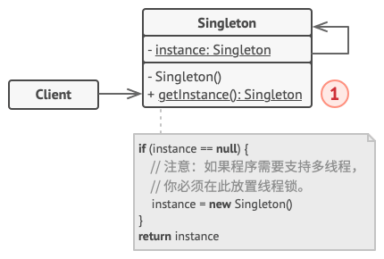

## 前言

Hi Coder，我是 CoderStar！

今天我们讲一个设计模式中最简单的一个设计模式，我想凡是 Coder，就应该没有没用过这个设计模式的。

## 单例模式



保证了只有一个对象实例的存在

优点：

- 节约系统资源
- 保证对实例对象访问的唯一入口

缺点

- 不能被继承，不能有子类
- 不易被重写，扩展性差；
- 单例对象只要程序运行就会一直占用系统内存，闲置时也会消耗系统内存资源

应用场景

- 当某项服务暴露给多个地方使用时，可以为这个服务封装一个单例的工具类，使其具有一个统一入口，比如 iOS
  中的 UserDefault 或者 FileManager，主题管理等操作
- 可以利用单例共享数据，如登录完成之后的用户信息，全局共享这一资源；

注意事项

- 线程安全问题

代码示例

```swift
final class Singleton {
    // 构造方法必须私有化
    private init() {}

    // Swift中，let本身就线程安全
    public static let shared = Singleton()
}
```

单例模式与静态属性之间的区别？

## 最后

要更加努力呀！

Let's be CoderStar!
